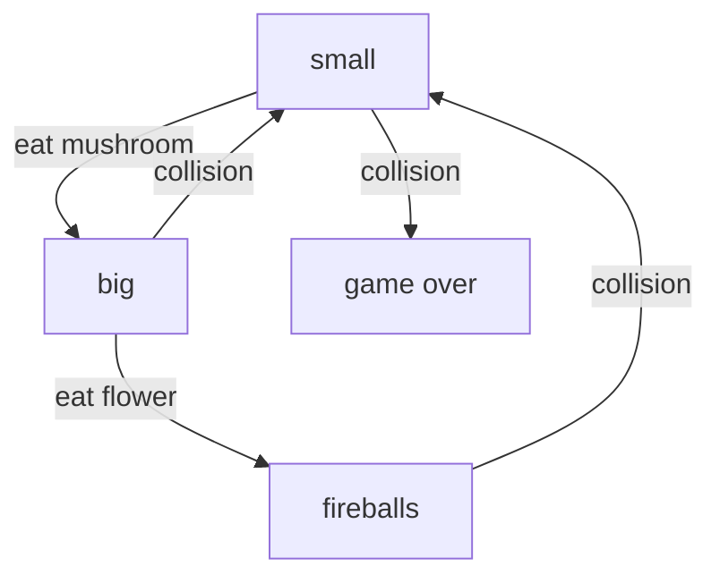

# Animation

This tutorial looks at animations.  Animations are one of the more complicated
aspects of JetLag.  You might need to read through this tutorial more than once
before it all makes sense.  You should also be sure to do the Graphical Assets
tutorial, since the ideas in it relate to how Animations work.

## State Machines

Before we try to animate anything, it's important to have some familiarity with
the idea of "state machines".  When an actor has a finite set of configurations,
and certain events determine how it transitions among those configurations, a
State Machine provides an elegant way to explain it all.  For example, if you're
familiar with the original Super Mario Bros game, you'll recall that Mario
starts "small".  If he eats a mushroom, he gets "big".  If he then eats a
flower, he gets firepower.  If he hits an enemy and is small, the level ends.
Otherwise, he shrinks.  We can express these rules very succinctly with a State
Machine diagram:



The diagram is unambiguous, and it also shows unintuitive things (like the way
that Mario doesn't go from "fireballs" to "big", but instead all the way back to
"small").

The reason that state machines are so important to Animations is that JetLag
needs to have a small library of animations on hand just to make a single
animated actor look good.  For example, if one Animation sequence works well for
an actor walking from left to right ("east"), then we'd want a different
sequence for walking from right to left ("west").  In fact, we might want eight
different directions (north, south, east, west, northeast, southeast, northwest,
southwest).  We might also want animations for when the actor is idle (not
walking) but facing in one of these eight directions.  We might also want
animations for jumping while moving in one of 8 directions, and for jumping
while standing still.  And also crawling.  And also when the hero is invincible.
Or tossing a projectile.  That's a lot of complexity.

Putting it all together, in JetLag we have 80 possible states.  It actually
should be more, but we skip a few things, like "tossing while jumping while
invincible".  The 80 states consist of one of 10 behaviors, multiplied by 8
directions:

- IDLE (IDLE_N, IDLE_NE, IDLE_E, IDLE_SE, IDLE_S, IDLE_SW, IDLE_W, IDLE_NW): The actor is not moving, and is facing in one of 8 directions
- WALK (WALK_N, WALK_NE, WALK_E, WALK_SE, WALK_S, WALK_SW, WALK_W, WALK_NW): The actor is moving in one of 8 directions
- TOSS_IDLE (TOSS_IDLE_N, TOSS_IDLE_NE, TOSS_IDLE_E, TOSS_IDLE_SE, TOSS_IDLE_S, TOSS_IDLE_SW, TOSS_IDLE_W, TOSS_IDLE_NW): The actor is not moving, and is tossing a projectile
- TOSS (TOSS_N, TOSS_NE, TOSS_E, TOSS_SE, TOSS_S, TOSS_SW, TOSS_W, TOSS_NW): The actor is moving and tossing
- INV_IDLE (INV_IDLE_N, INV_IDLE_NE, INV_IDLE_E, INV_IDLE_SE, INV_IDLE_S, INV_IDLE_SW, INV_IDLE_W, INV_IDLE_NW): The actor is stationary and invincible
- INV (INV_N, INV_NE, INV_E, INV_SE, INV_S, INV_SW, INV_W, INV_NW) The actor is moving and invincible
- JUMP_IDLE (JUMP_IDLE_N, JUMP_IDLE_NE, JUMP_IDLE_E, JUMP_IDLE_SE, JUMP_IDLE_S, JUMP_IDLE_SW, JUMP_IDLE_W, JUMP_IDLE_NW) The actor is jumping in place
- JUMP (JUMP_N, JUMP_NE, JUMP_E, JUMP_SE, JUMP_S, JUMP_SW, JUMP_W, JUMP_NW): The actor is jumping while walking
- CRAWL_IDLE (CRAWL_IDLE_N, CRAWL_IDLE_NE, CRAWL_IDLE_E, CRAWL_IDLE_SE, CRAWL_IDLE_S, CRAWL_IDLE_SW, CRAWL_IDLE_W, CRAWL_IDLE_NW): The actor is crouching, but not moving
- CRAWL (CRAWL_N, CRAWL_NE, CRAWL_E, CRAWL_SE, CRAWL_S, CRAWL_SW, CRAWL_W, CRAWL_NW) The actor is crouching and moving in one of 8 directions

Not all games will use all 80 of these states.  In addition, sometimes we want
to use a single Animation sequence for several of the states.

## Getting Started

To begin, you'll need the "sprites.json", "sprites.png", and "mid.png" files from the Graphical Assets tutorial.  We'll add two more files (one spritesheet):

- [alien.png](animations/alien.png)
- [alien.json](animations/alien.json)

(If you're wondering, I used the [Universal LPC Spritesheet
Generator](https://sanderfrenken.github.io/Universal-LPC-Spritesheet-Character-Generator/)
to make these images.  It gave me one big image, but no .json file, so I had to
cut its image up into a bunch of files, then re-pack them through TexturePacker
to get a .json file.)

## IDLE_E: The Default Animation

Let's make our first animated sprite.  It will use the coin images from `sprites.png` to make a coin that rotates:

```iframe
{
    "width": 800,
    "height": 450,
    "src": "assets_audio_animations.html?8"
}
```

The easiest way to make an animation is to use `AnimationSequence.makeSimple()`.
It lets us take a bunch of images and create a flipbook-style animation by
cycling through them one at a time, showing each for the same amount of time.
We can make an animation for our coins like this.  Since `repeat` is true, it
will restart once it reaches the end:

```typescript
    let coins = AnimationSequence.makeSimple({
      timePerFrame: 50,
      repeat: true,
      images: ["coin0.png", "coin1.png", "coin2.png", "coin3.png", "coin4.png", "coin5.png", "coin6.png", "coin7.png"]
    });
```

In JetLag, the default animation is `IDLE_E`.  Every `AnimatedSprite` needs to
have this.  But how do we get it to the actor?  It would be tedious to have to pass in 80 different animations, so instead we create a map.

Briefly, a map is like a phone book or dictionary: it lets us associate some
value with some other value (kine of like a name to a phone number, or a word to
its definition).  Our map will go from the different animation states to
`AnimationSequence`s.  For this example, we just need one animation, so it's
pretty easy:

```typescript
    let animation_map = new Map();
    animation_map.set(AnimationState.IDLE_E, coins);
```

Now that we've done that, we can make an actor whose appearance is an
`AnimatedSprite`:

```typescript
    new Actor({
      appearance: new AnimatedSprite({ width: .5, height: .5, animations: animation_map }),
      rigidBody: new CircleBody({ cx: 5, cy: 2, radius: .25 }),
    });
```

## Manually Advancing Animations

When we learned about `PathMovement`, one neat feature was the ability to re-use
the same path, but "advance" it for different actors, so they didn't start at
the same place.  We can do the same for animations:

```iframe
{
    "width": 800,
    "height": 450,
    "src": "assets_audio_animations.html?9"
}
```

The first part of this code is just like before: we make a map and set up an
animation for the `IDLE_E` state:

```typescript
    let animation_map = new Map();
    let coins = AnimationSequence.makeSimple({
      timePerFrame: 50,
      repeat: true,
      images: ["coin0.png", "coin1.png", "coin2.png", "coin3.png", "coin4.png", "coin5.png", "coin6.png", "coin7.png"]
    });
    animation_map.set(AnimationState.IDLE_E, coins);
```

This time, though, we'll make a loop that draws 16 coins.  For each coin, we'll
use "skip to" to jump forward in the animation sequence.  When skipping, we can
select which frame of the animation to use, and how many milliseconds into the
frame to pretend have transpired.  In this code, we use `Math.trunc(i/2)` to
turn the loop index into a whole number for the frame, and then we use
`(i%2)*.25` so that every other coin will be halfway through its 50-millisecond
animation.

```typescript
    // Now we can use it
    for (let i = 0; i < 16; ++i) {
      let coin = new Actor({
        appearance: new AnimatedSprite({ width: .5, height: .5, animations: animation_map }),
        rigidBody: new CircleBody({ cx: i + .5, cy: 2, radius: .25 }),
      });
      (coin.appearance as AnimatedSprite).skipTo(Math.trunc(i / 2), (i % 2) * .25);
    }
  }
```

## Animations With Varying Time

Sometimes we want the different frames of an animation to display for different
lengths of time.  For example, when a character is standing idly, we might want
them to just shrug every now and then, so it's clear they aren't a statue.

```iframe
{
    "width": 800,
    "height": 450,
    "src": "assets_audio_animations.html?10"
}
```

We'll get this behavior by making our `AnimationSequence` in a different way.
Instead of using an array of image names, we'll use the `.to()` syntax (similar
to `PathMovement`) to give a time (in milliseconds) for each frame.

To begin, let's make the animation object.  I'm being a more terse in this code,
by not using `let` to create a variable for the `AnimationSequence`... instead,
I'm just making it on the fly, while putting it into the map.

```typescript
    let animations = new Map();
    animations.set(AnimationState.IDLE_E, new AnimationSequence(true).to("alien_thrust_r_0.png", 750).to("alien_thrust_r_1.png", 75));
```

With the animation made, we can use it in the same way as before, by giving an
actor an `AnimatedSprite` as its appearance:

```typescript
    new Actor({
      rigidBody: new BoxBody({ cx: 3, cy: 4, width: 1, height: 2 }),
      appearance: new AnimatedSprite({ width: 2, height: 2, animations }),
      role: new Hero(),
    });
```

## Our First State Machine

We're now ready to try to make an actor whose animation changes based on their
state.  In this case, we'll just try to get the actor to use the correct IDLE
animation when facing N/S/E/W, and the correct WALK animation when walking
N/S/E/W:

```iframe
{
    "width": 800,
    "height": 450,
    "src": "assets_audio_animations.html?11"
}
```

As you're working, remember that the two most common kinds of 2D games are those
with an overhead view, and those with a side view.  In overhead mode, it makes
sense to have animations for 8 different directions: N, NE, E, SE, S, SW, W, and
NW. But sometimes just 4 is good enough.

You'll notice right away that it's a bit glitchy: if you walk in a diagonal, the
behavior is not right.  Don't worry about that yet.  First, let's just get our
eight animations working.  The animation sequences for walking are all similar:

```typescript
    let animations = new Map();
    animations.set(AnimationState.WALK_N, AnimationSequence.makeSimple({
      timePerFrame: 75, repeat: true,
      images: ["alien_walk_u_0.png", "alien_walk_u_1.png", "alien_walk_u_2.png", "alien_walk_u_3.png", "alien_walk_u_4.png", "alien_walk_u_5.png", "alien_walk_u_6.png", "alien_walk_u_7.png", "alien_walk_u_8.png"]
    }));
    animations.set(AnimationState.WALK_W, AnimationSequence.makeSimple({
      timePerFrame: 75, repeat: true,
      images: ["alien_walk_l_0.png", "alien_walk_l_1.png", "alien_walk_l_2.png", "alien_walk_l_3.png", "alien_walk_l_4.png", "alien_walk_l_5.png", "alien_walk_l_6.png", "alien_walk_l_7.png", "alien_walk_l_8.png"]
    }));
    animations.set(AnimationState.WALK_S, AnimationSequence.makeSimple({
      timePerFrame: 75, repeat: true,
      images: ["alien_walk_d_0.png", "alien_walk_d_1.png", "alien_walk_d_2.png", "alien_walk_d_3.png", "alien_walk_d_4.png", "alien_walk_d_5.png", "alien_walk_d_6.png", "alien_walk_d_7.png", "alien_walk_d_8.png"]
    }));
    animations.set(AnimationState.WALK_E, AnimationSequence.makeSimple({
      timePerFrame: 75, repeat: true,
      images: ["alien_walk_r_0.png", "alien_walk_r_1.png", "alien_walk_r_2.png", "alien_walk_r_3.png", "alien_walk_r_4.png", "alien_walk_r_5.png", "alien_walk_r_6.png", "alien_walk_r_7.png", "alien_walk_r_8.png"]
    }));
```

Likewise, the sequences for standing idle are all familiar to what we've seen so
far:

```typescript
    animations.set(AnimationState.IDLE_N, new AnimationSequence(true).to("alien_thrust_u_0.png", 750).to("alien_thrust_u_1.png", 75));
    animations.set(AnimationState.IDLE_W, new AnimationSequence(true).to("alien_thrust_l_0.png", 750).to("alien_thrust_l_1.png", 75));
    animations.set(AnimationState.IDLE_S, new AnimationSequence(true).to("alien_thrust_d_0.png", 750).to("alien_thrust_d_1.png", 75));
    animations.set(AnimationState.IDLE_E, new AnimationSequence(true).to("alien_thrust_r_0.png", 750).to("alien_thrust_r_1.png", 75));
```

With the hard work done, we can make a hero, use these animations for its
`AnimatedSprite`, and connect the keyboard to the hero's movement:

```typescript
    boundingBox();

    let hero = new Actor({
      rigidBody: new BoxBody({ cx: 3, cy: 4, width: 1, height: 2 }),
      appearance: new AnimatedSprite({ width: 2, height: 2, animations }),
      role: new Hero(),
      movement: new ManualMovement(),
    });

    stage.keyboard.setKeyUpHandler(KeyCodes.KEY_UP, () => ((hero.movement as ManualMovement).updateYVelocity(0)));
    stage.keyboard.setKeyUpHandler(KeyCodes.KEY_DOWN, () => ((hero.movement as ManualMovement).updateYVelocity(0)));
    stage.keyboard.setKeyUpHandler(KeyCodes.KEY_LEFT, () => ((hero.movement as ManualMovement).updateXVelocity(0)));
    stage.keyboard.setKeyUpHandler(KeyCodes.KEY_RIGHT, () => ((hero.movement as ManualMovement).updateXVelocity(0)));

    stage.keyboard.setKeyDownHandler(KeyCodes.KEY_UP, () => ((hero.movement as ManualMovement).updateYVelocity(-5)));
    stage.keyboard.setKeyDownHandler(KeyCodes.KEY_DOWN, () => ((hero.movement as ManualMovement).updateYVelocity(5)));
    stage.keyboard.setKeyDownHandler(KeyCodes.KEY_LEFT, () => ((hero.movement as ManualMovement).updateXVelocity(-5)));
    stage.keyboard.setKeyDownHandler(KeyCodes.KEY_RIGHT, () => ((hero.movement as ManualMovement).updateXVelocity(5)));
```

## Re-mapping Animations

In the previous example, things looked quite odd when we tried to make the hero walk in a diagonal line... in every case, it defaulted to `IDLE_E`.  Worse, when the hero stopped moving, sometimes it bounced out of `IDLE_E`.

One solution would be to add eight more animations (IDLE_NE, IDLE_NW, IDLE_SE
IDLE_SW, WALK_NE, WALK_NW, WALK_SE, and WALK_SW).  But that would bring a new
problem: when the hero switched from walking west to walking northwest, its
animation would reset.  In the following code, see if you can detect the subtle
visual glitch:

```iframe
{
    "width": 800,
    "height": 450,
    "src": "assets_audio_animations.html?12"
}
```

JetLag lets us "re-map" animations.  This gives us a way of saying "when the
state moves to Y, use the animation from state X, and if it was in X, don't
restart the animation".  In the following mini-game, you should not see the
glitch anymore:

```iframe
{
    "width": 800,
    "height": 450,
    "src": "assets_audio_animations.html?13"
}
```

The way we get this behavior is by making another map, the "remap", and
including it in the line for making the `AnimatedSprite`.  For starters, you'll
want to add these lines of code:

```typescript
    let remap = new Map();
    remap.set(AnimationState.WALK_NE, AnimationState.WALK_E);
    remap.set(AnimationState.WALK_SE, AnimationState.WALK_E);
    remap.set(AnimationState.WALK_NW, AnimationState.WALK_W);
    remap.set(AnimationState.WALK_SW, AnimationState.WALK_W);

    remap.set(AnimationState.IDLE_NE, AnimationState.IDLE_E);
    remap.set(AnimationState.IDLE_SE, AnimationState.IDLE_E);
    remap.set(AnimationState.IDLE_NW, AnimationState.IDLE_W);
    remap.set(AnimationState.IDLE_SW, AnimationState.IDLE_W);
```

Then you can add `remap` when making a `new AnimatedSprite`:

```typescript
    let hero = new Actor({
      rigidBody: new BoxBody({ cx: 3, cy: 4, width: 1, height: 2 }),
      appearance: new AnimatedSprite({ width: 2, height: 2, animations, remap }),
      role: new Hero(),
      movement: new ManualMovement(),
    });
```

## Side-View Animations

A lot of what we've seen so far has been specific to games with an overhead
view.  Let's now make a side-view game, to see how remapping works a little bit
differently.  Here's the game we'll make:

```iframe
{
    "width": 800,
    "height": 450,
    "src": "assets_audio_animations.html?14"
}
```

In the game, tilt moves the actor left/right, but there is a lot of friction to
slow things down.  This will let us really see the animations in detail.

We'll start by setting up gravity, tilt, a bounding box, and a background:

```typescript
    stage.world.setGravity(0, 10);
    enableTilt(10, 0);
    boundingBox()
    stage.backgroundColor = "#17b4ff";
    stage.background.addLayer({ anchor: { cx: 8, cy: 4.5, }, imageMaker: () => new ImageSprite({ width: 16, height: 9, img: "mid.png" }), speed: 0 });
```

The hero has one animation when it is not in the air, another when it is.  Note
that "jump_right" will also be used when jumping to the left, if there is no
"jump_left".  With that as our plan, we can make the two animations like this:

```typescript
    let idle_right = AnimationSequence.makeSimple({ timePerFrame: 150, repeat: true, images: ["color_star_1.png", "color_star_2.png"] })
    let jump_right = AnimationSequence.makeSimple({ timePerFrame: 150, repeat: true, images: ["color_star_4.png", "color_star_6.png"] });
    let animations = new Map();
    animations.set(AnimationState.IDLE_E, idle_right);
    animations.set(AnimationState.JUMP_E, jump_right);
```

You probably guessed that we'll want to do some re-mapping:

```typescript
    // Remap JUMP_W to JUMP_E
    let remap = new Map();
    remap.set(AnimationState.JUMP_W, AnimationState.JUMP_E);
```

But in truth, there's a lot more remapping that it seems like we need.
Fortunately, there is another way.  JetLag understands that there are two
dominant views (overhead and side), and that there are different (but still
reasonable) default remappings for each.  Let's make our hero:

```typescript
    let h_cfg = ;
    let h = new Actor({
      appearance: new AnimatedSprite({ width: 0.8, height: 0.8, animations, remap }),
      rigidBody: new CircleBody({ cx: 0.25, cy: 7, radius: 0.4 }, { density: 5, friction: 0.6, disableRotation: true }),
      movement: new TiltMovement(),
      role: new Hero(),
    });
    stage.keyboard.setKeyDownHandler(KeyCodes.KEY_SPACE, () => { (h.role as Hero).jump(0, -5); });
```

Instead of remapping JUMP_NE, JUMP_SE, JUMP_NW, JUMP_SW, we can tell the
AnimatedSprite that this is a side-view game, and it will do the work for us.

```typescript
    (h.appearance as AnimatedSprite).stateSelector = AnimatedSprite.sideViewAnimationTransitions;
```

Note that you can make your own transition maps and assign them to the
`stateSelector`.  The default one is for overhead view, and JetLag only provides
one more, for side view.  If you need something else, you've probably advanced to a point where you don't need a tutorial to help you figure it out :)

The last thing we'll do in our game is add a disappearance animation.  We'll add
a goodie, and give it an `onDisappear` component.  The component will draw a new
actor (with `Passive` role) and give it an animation that does not repeat.  The
last frame of the animation will be a blank image.

```typescript
    new Actor({
      appearance: new ImageSprite({ width: 0.5, height: 0.5, img: "star_burst_3.png" }),
      rigidBody: new CircleBody({ cx: 2, cy: 7.5, radius: 0.25 }),
      role: new Goodie(),
      onDisappear: (a: Actor) => {
        let animations = new Map();
        animations.set(AnimationState.IDLE_E, new AnimationSequence(false).to("star_burst_3.png", 200).to("star_burst_2.png", 200).to("star_burst_1.png", 200).to("star_burst_4.png", 200));
        new Actor({
          appearance: new AnimatedSprite({ animations, width: .5, height: .5 }),
          rigidBody: new BoxBody({ cx: a.rigidBody.getCenter().x, cy: a.rigidBody.getCenter().y, width: .5, height: .5 }, { collisionsEnabled: false }),
        })
      }
    });
```

## Wrapping Up

In this tutorial, we didn't look at the other animations, like invincible,
crawling, or tossing.  Be sure to check out the "platformer" tutorial and the
"overhead fighting and farming" tutorial for more examples of animations.

```md-config
page-title = Animations
img {display: block; margin: auto; max-width: 75%;}
.max500 img {max-width: 500px}
```
