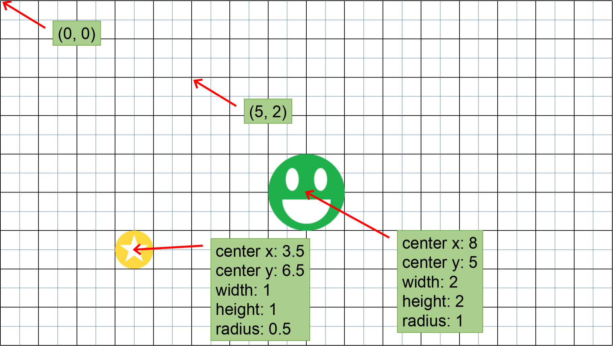
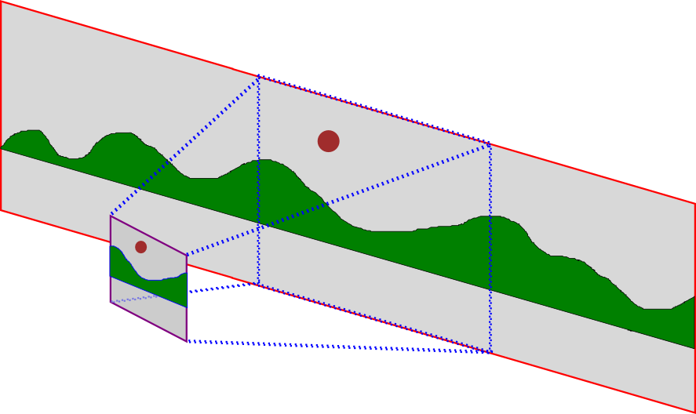

# The Camera and Gravity

IDK

## The Game Loop

If you have taken an introductory computer science class, you've probably
learned to think about programming in a very specific way, where you write code,
and that tells the computer what to do.  When you think about a game, this
probably leads you to imagine code that would look like this:

```typescript
configure_world();
while (!user_requested_to_exit_game()) {
    handle_events();
    update_screen();
}
```

This is often referred to as an "event handling loop", "event processing loop",
or just "event loop".

Let's break it down a bit.  First, we set up the initial state of the game. Then
there is a loop that runs over and over again, until
`user_requested_to_exit_game` returns `true`.  Each time the loop runs, it
checks for events, and uses them to update the stage (`handle_events()`).  Then
it draws the game to the screen (`update_screen()`).

JetLag is responsible for handling this loop.  But it's good to have this loop
in mind, because it helps you to see how your code fits into the big picture.
You'll write code that corresponds to `configure_world()`, and in it, you'll set
up some scripts to run in response to certain events.  Then the game will start.
`handle_events()` will use those scripts when appropriate (i.e., when the
corresponding event happens).

## The Camera

In most games, the world is too big to fit on the screen all at once.  Instead,
only a part of the world is displayed.  The easiest way to think about how this
works is by imagining that there is a camera filming your world.  The camera
should follow the action, zoomed in on the most important part.  The following
picture can be helpful in understanding the idea:


In the picture, the shape with the red outline is the world.  The shape with the purple outline is the camera.  The blue dotted lines show a projection from the world onto the camera, so that we can see just a portion of the world at any time.

An important concept is that you can put actors onto the *camera* instead of
into the *world*.  This can be useful for informational text, user interface
buttons, and other things that aren't part of the world, and that need to be
visible all the time.

## Putting It All Together: Our First "Game"



In LibLOL, the coordinate system starts in the bottom left corner.  So (0, 0) is bottom left, and as we move up and to the right, the y and x values get larger, respectively.

The last important aspect here is the relationship between the units of the world and the units of the camera.  We're going to measure our world in meters, and our camera in pixels.  In LibLOL, there are 20 pixels per meter.  We're also going to assume that the camera is 960 pixels wide by 640 pixels high.  LibGDX will stretch our game to look nice on any phone, but starting with a 960x640 camera (which shows 48x32 meters) gives good resolution and a good width-to-height ratio for most phones.

## Events

## Out of date stuff

Making Games in Liblol: Part 1: The Important Files
The first step in learning to use liblol is understanding how the files are laid out, and what each file is expected to do.  In this tutorial, I'll cover the basics of what goes where, and how everything fits together.

Let's start by taking a quick look at the way Android Studio should look when you get started:


On the left hand side, we're in the "Project" view, and there are three entries in the list: android, core, and desktop.  (Note: if you can't see this, try either holding "Alt" and typing the number "1", or clicking on "1: Project" on the far left).

The "lol" in liblol stands for "Lehigh Overlay for LibGDX".  Lehigh is the university where I'm a professor.  An "overlay" is a layer of code that sits on top of another layer of code, to wrap, extend, or simplify its functionality.  And LibGDX is an amazing system for developing cross-platform games in Java.

In LibGDX, a game consists of multiple folders.  "Core" is where your main game code goes.  "Android" has a small wrapper that describes how to run your game as an Android application.  "Desktop" has a small wrapper that describes how to run your game on your computer.  It's also possible to create an "ios" folder, for iPhone/iPad/iPod development, and an "html" folder for developing games that can be played through a web browser.

Expand the "core" folder, and you'll see an entry called "java".  This is where all the code goes.  If you expand it, you'll see two more folders: "com.me.mylolgame" and "edu.lehigh.cse.lol".  The first of these is where you'll write code.  The second is where the code for liblol itself goes.  Open up "com.me.mylolgame", and you should see a screen like this:


There are six files: Chooser, Help, Levels, MyGame, Splash, and Store.  Of these, all but MyGame follow the same pattern: there is a method called "display", which is responsible for drawing an interactive screen representing part of the game.  The five files correspond to five key parts of any game: the opening screen (Splash), the help system (Help), the screens for picking which level to play (Chooser), a store for buying power-ups and upgrades using in-game currency (Store), and the actual playable levels of the game (Levels).  MyGame is where we configure the game.  Let's start there:

Basic Game Configuration
Let's take a look at the structure of MyGame.java:


/**
 * The starting point for a Lol game is right here. This code does two important
 * configuration tasks: it loads all the assets (images and sounds) used by the
 * game, and it tells the Lol engine about all of the other configuration that
 * needs to be done.
 * 
 * Be sure to look at the Levels.java file for how each level of the game is
 * drawn, as well as Splash.java, Chooser.java, Help.java, and Store.java.
 */
public class MyGame extends Lol {
    /**
     * Set up all the global configuration options for the game
     */
    @Override
    public void configure() {
        ...
    }

    /**
     * Load all the images and sounds used by our game
     */
    @Override
    public void loadResources() {
        ...
    }
}

This says that there are two functions: configure(), which sets our global configuration, and loadResources(), which gets all of the images and sounds ready for use in our game.

Let's look at configure() first:


    /**
     * Set up all the global configuration options for the game
     */
    @Override
    public void configure() {
        // to see documentation for any of these variables, hover your mouse
        // over the word on the left side of the equals sign
        mWidth = 960;
        mHeight = 640;
        mNumLevels = 92;
        mEnableVibration = true;
        mUnlockAllLevels = true;
        mShowDebugBoxes = true;
        mStorageKey = "com.me.mylolgame.prefs";
        mDefaultFontFace = "arial.ttf";
        mDefaultFontSize = 32;
        mDefaultFontRed = 0;
        mDefaultFontGreen = 0;
        mDefaultFontBlue = 0;
        mDefaultWinText = "Good Job";
        mDefaultLoseText = "Try Again";
        mGameTitle = "My Lol Game";
        mEnableChooser = true;

        // don't change these lines unless you know what you are doing
        mLevels = new Levels();
        mChooser = new Chooser();
        mHelp = new Help();
        mSplash = new Splash();
        mStore = new Store();
    }

This code does two things: first, it sets the default values that are used throughout liblol.  These include the size of the screen, the number of levels, whether to run in debug mode, how to configure the default font, and what some of the default text values should be.  As the comment in the code says, you can hover over each of the variables to get additional information.  Here's an example:


The text in the Documentation window is automatically generated from the comments in the code.  This is a good point to keep in mind: if you document your code, then the tools will help you understand it later on, when there's more code than you can remember!

The second part of the configure() method tells LibLOL about the five components of your game.  It's rare that you'll need to change these lines.

Configuring and Loading Images and Sounds
The next part of MyGame.java is a little bit trickier.  The code looks easy enough:


    /**
     * Load all the images and sounds used by our game
     */
    @Override
    public void loadResources() {
        // load regular (non-animated) images
        Media.registerImage("greenball.png");
        Media.registerImage("mustardball.png");
        Media.registerImage("red.png");
        Media.registerImage("leftarrow.png");
        Media.registerImage("rightarrow.png");
        Media.registerImage("backarrow.png");
        Media.registerImage("redball.png");
        Media.registerImage("blueball.png");
        Media.registerImage("purpleball.png");
        Media.registerImage("msg1.png");
        Media.registerImage("msg2.png");
        Media.registerImage("fade.png");
        Media.registerImage("greyball.png");
        Media.registerImage("leveltile.png");
        Media.registerImage("audio_on.png");
        Media.registerImage("audio_off.png");

        // load the image we show on the main screen
        Media.registerImage("splash.png");

        // load the image we show on the chooser screen
        Media.registerImage("chooser.png");

        // load background images
        Media.registerImage("mid.png");
        Media.registerImage("front.png");
        Media.registerImage("back.png");

        // load animated images (a.k.a. Sprite Sheets)
        Media.registerAnimatableImage("stars.png", 8, 1);
        Media.registerAnimatableImage("stars_flipped.png", 8, 1);
        Media.registerAnimatableImage("flystar.png", 2, 1);
        Media.registerAnimatableImage("starburst.png", 4, 1);
        Media.registerAnimatableImage("colorstar.png", 8, 1);

        // load sounds
        Media.registerSound("hipitch.ogg");
        Media.registerSound("lowpitch.ogg");
        Media.registerSound("losesound.ogg");
        Media.registerSound("slowdown.ogg");
        Media.registerSound("woowoowoo.ogg");
        Media.registerSound("fwapfwap.ogg");
        Media.registerSound("winsound.ogg");

        // load background music
        Media.registerMusic("tune.ogg", true);
    }

All that's happening is that we're loading image and sound files, and providing a bit of information about them.  But where do these files come from?  If you switch to the "Project" view and navigate to the android/assets folder, you'll see that all these files are saved there:


You can even drag and drop files into this folder of Android Studio to add media to your game.

There are four patterns in this code:

Media.registerImage() - register a plain .png image for use in the game
Media.registerSound() - register an .ogg file for use as a short sound effect in the game
Media.registerMusic() - register an .ogg file for use as a long-playing background music in the game; you must also indicate whether the music should loop or not
Media.registerAnimatableImage - register a .png image for use in the game, but indicate that the image should be treated as a grid, so that you can employ flipbook-style animation

Note: if you register a sound, you cannot use it as music in your code, and vice-versa.

About this "animatable" image idea: the best way to understand it is with an example.  Consider the following (horribly drawn) image:


We may want to have a character in the game that is shaped like a star, but with a color that is constantly changing.  If we register the above image as having 8 columns and 1 row, then LibLOL will only show 1/8 of the image at any time, and we can use our code to indicate how to cycle through the 8 images.

People often ask "can I use .mp3 files?" and "do I have to use .png images?".  It's possible to use .mp3 files, but you should be sure that there are no licensing restrictions on your use of the mp3 format in your game.  As for png files, they are almost always a better choice than jpegs.  The png file format supports transparency, and it uses lossless compression.  That means it won't blur the lines of a carefully drawn cartoon.  Using jpeg is fine for full-screen background images.  That's about it.  You should never use wav audio files or gif images.

Making Interactive Screens
This tutorial is a bit longer than I expected, so we're going to wait until next time to talk about how to make the individual interactive screens (Splash, Chooser, Levels, Help, Store).  However, you should feel free to explore these files now.  As you do, remember two things:

There should be ample comments, especially in the earlier parts of each file, to help you understand what is going on.
If you are trying to find a specific feature, you can look at the LibLOL JavaDocs.  Oh, and just to reinforce a point: all of those JavaDoc web pages were automatically generated from the comments in the code... if you comment your code well, the tools will work for you!

The levels of the code I provide are not really meant to be enjoyable.  Instead, they are meant to provide a demonstration of how the different features of LibLOL work.  I encourage students to read my code while running it / playing the game.  Then, I suggest they make small changes to the code and re-run it.  Doing this (reading while running) is the best way to gain an appreciation for how the code works, so that you can figure out how to use it to make a new game.

So by all means, go ahead and start reading the code and playing the levels of my sample game.  As you do, you should get a sense for how LibLOL makes it easy to achieve complex effects in your game.  And if you can't find a feature you need, leave a comment... the feature may be there and you just don't see it, or it may be in the LibGDX package, just waiting for me to provide an easy interface to it within LibLOL.

## Creating Levels

Making Games in Liblol: Part 2: Creating Levels
In LibLOL, we put the code for all of the levels into a single file called "Levels.java".  If you open that file, you'll see that there's one method, called "display()":


    /**
     * Display one of the screens
     *
     * @param which The screen to display. Your code should use an /if/ statement
     *              to decide what screen to display based on the value of /which/
     */
    void display(int which) {
        ...
    }

Inside of this method, you'll see that there's a lengthy "if" statement:


    if (whichLevel == 1) {
        ...
    }

    else if (whichLevel == 2) {
        ...
    }
    ...

The code for each level is self-contained in one of these "if" blocks.  Technically, you don't have to do things this way, and when your game gets sufficiently complex, you'll want to change things.  But for now, it's easier to just put all of your code in one place.

Everything is an Event
Writing games is different than writing the kind of code that most people learn in their introductory computer science classes.  Fundamentally, a game is a simulation.  At all times, the game has some sort of state, and some rules that apply to that state.  At fixed intervals (every 1/60th of a second), the rules are applied to the state of the game to produce a new state.  So, for example, if the state consists of a single actor at position (0, 0) with a velocity of (6, 6), then after one interval passes, the rules will be applied, the actor will be moved to (.1, .1), and the game will be re-drawn.

When the player interacts with the game, either by tilting the phone or touching the screen, it creates an event.  Similarly, when certain special collisions happen between the actors in the game, or when timers expire, we have events.  The way to change the state of the game is in response to events.

The first event that matters is the event for starting a level.  Our "display" function is precisely for this purpose.  When the player touches a button on the chooser, then display() will be called, with the selected level passed in as whichLevel.  Our code runs in response to that event, to configure the initial state of the game.  It's important to remember that your game won't start playing until you finish drawing the initial state.  So, for example, you can't draw an infinitely long level in the display() code, or you'll never get to the point where you can start playing the game.

With that said, let's look at how to draw a level.

A World, and a Camera

A Very Simple Level
Now that we've gone over those details, we can start writing the levels of a game.  Remember that the game levels that you get when you check out the LibLOL code are meant to demonstrate how to use the code, and that you're encouraged to change them as you learn, and then replace them as you create your own game.  Let's take a look at level 1 of the demos:


        /*
         * In this level, all we have is a hero (the green ball) who needs to
         * make it to the destination (a mustard colored ball). The game is
         * configured to use tilt to control the hero.
         */
        if (whichLevel == 1) {
            // set the screen to 48 meters wide by 32 meters high... this is
            // important, because Config.java says the screen is 480x320, and
            // LOL likes a 20:1 pixel to meter ratio. If we went smaller than
            // 48x32, things would get really weird. And, of course, if you make
            // your screen resolution higher in Config.java, these numbers would
            // need to get bigger.
            //
            // Level.configure MUST BE THE FIRST LINE WHEN DRAWING A LEVEL!!!
            Level.configure(48, 32);
            // there is no default gravitational force
            Physics.configure(0, 0);

            // in this level, we'll use tilt to move some things around. The
            // maximum force that tilt can exert on anything is +/- 10 in the X
            // dimension, and +/- 10 in the Y dimension
            Tilt.enable(10, 10);

            // now let's create a hero, and indicate that the hero can move by
            // tilting the phone. "greenball.png" must be registered in
            // the registerMedia() method, which is also in this file. It must
            // also be in your android game's assets folder.
            Hero h = Hero.makeAsCircle(4, 17, 3, 3, "greenball.png");
            h.setMoveByTilting();

            // draw a circular destination, and indicate that the level is won
            // when the hero reaches the destination. "mustardball.png" must be
            // registered in registerMedia()
            Destination.makeAsCircle(29, 26, 2, 2, "mustardball.png");
            Score.setVictoryDestination(1);
        }

There are only seven lines of code.  Let's work through them, one at a time.

Level.configure() -- This line should always be the first line of code when drawing a level.  It is responsible for saying how big the physical world is for this game.  We've made it 48 meters x 32 meters, which is as small as a level can be, given the size of our camera and our pixel-to-meter ratio.  In general, if you're making a non-scrolling game, these dimensions are good.  When this line of code finishes, there is a physical world into which we can place actors.
Physics.configure(0, 0) -- This line indicates that there are no default forces acting on actors in the level.  This makes sense for a game where the player is supposed to be looking down at the action.  For a Mario-style game, where the view is from the side, (0, -10) is a common setting.
Tilt.enable(10, 10) -- This level is going to use the tilt of the phone (note: when running on the desktop, use the arrows to simulate tilt).  The numbers passed to this function set thresholds for how much force you can produce via tilting.  In this case, no matter how steep the angle, we'll say that the phone produces no more than 10 units of force.
Hero.makeAsCircle(4, 17, 3, 3, "greenball.png") -- This line creates an actor who is a "hero".  The hero will be drawn such that it is 3 meters wide by 3 meters high, and its bottom left corner will be at the coordinate (4, 17).  If that didn't make sense, take a look at the following image, which would correspond to Hero.makeAsCircle(7, 10, 3, 3, "greenball.png")

h.setMoveByTilting() -- This indicates that the hero we just made is going to be controlled by the tilt of the phone.
Destination.makeAsCircle(29, 26, 2, 2, "mustardball.png") -- This draws the destination (the place the hero must reach).
Score.setVictoryDestination(1) -- There are many ways to win a level... surviving for long enough, defeating enough enemies, collecting enough goodies, etc.  In this case, we are saying that once one hero reaches the destination, the level should end.
You should feel free to modify these lines of code and see what happens.  Change numbers.  Delete lines.  In some cases, your game will still work.  In others, Android Studio will inform you that your code is no longer valid.  Once you get comfortable with level 1, move on to subsequent levels and start exploring.  Hopefully you'll find that LibLOL makes it easy to get very advanced effects using only a small number of lines of code.

## The Splash Screen

Making Games in Liblol: Part 3: Configuring the Splash Screen
The folks at Studyhall Entertainment put out a new game using LibLOL, and on the splash screen, they had animations.  My first thought was that it was a really clever effect (and they even took control of the "back" button as a way of re-generating the animation... sweet!).  But then I started to wonder how they even did it, since the LibLOL splash screen was didn't have physics support.

Long story short, I decided to make the splash screen (and the chooser, and the help screens) into a physics world.  This meant throwing out a lot of code, and then making the splash screen adopt the same interface as playable levels.  Now there's less code for me to maintain, and fewer interfaces for programmers to learn.  Win-win.

To explain the splash screen, it's going to be useful to discuss a few other concepts first:

The Heads-Up Display
There are times when we want to draw things on the camera, instead of in the world.  A great example of this is in Mario-style games.  No matter where the hero is, we want the time, number of lives, and coin count in the top-left corner.  Putting text in the world wouldn't work: as Mario moves, the text would scroll off the screen.  In a phone game, where touching the screen is a way of controlling the action, we might also want to draw buttons on the camera instead of the world.  

It is confusing to think of "drawing on the camera", so games use the term "heads-up display", or HUD, to refer to anything drawn on the camera.  In LibLOL, we can put information (images and text) onto the HUD through the "Display" feature, and we can put buttons onto the HUD through the "Control" feature.

Callbacks
Recall that a game is a simulation.  Part of what that means is that we can change the state of the simulation in response to special events, like screen touches.  But that also means we need to be able to provide code that doesn't run until the event happens.  Callbacks are a way of providing this functionality.  Consider the following code:


        Control.addCallbackControl(96, 186, 160, 80, "", new LolCallback() {
            public void onEvent() {
                Lol.doHelp(1);
            }
        });

This code says "draw a button on the screen, and when the player presses it, run the code I'm providing".

In truth, most of the code for making controls in LibLOL is much simpler than this, because I provide the code to run when the button is pressed.  You don't need to write your own callbacks for jumping, running, ducking, throwing projectiles, and so on.  Callback controls are really only for custom behaviors.  But since they're there, I wanted to demo them, and what better place than the splash screen?

Let's look at this code in more detail.  We are drawing a control with a bottom left coordinate of (96, 186), a width of 160, and a height of 80.  We are not providing an image for the control (""), and hence it is invisible.  We could give an image, which would be drawn on top of the world.  We could give a partially-transparent image, too, so that the world would be visible through the image of the control.  But that's not important right now.

What is important is the last part of the code: "new LolCallback() { ... });"  This is a lot of text, and in the end, it's just to say "run Lol.doHelp(1) when the control is pressed".  Java 1.8 provides a cleaner way of writing this code, but Android Studio doesn't support Java 1.8 yet.  When it does, this code will get a lot cleaner.

If callbacks don't make complete sense right now, it's OK.  Most Computer Science programs don't teach callbacks (technically "anonymous classes") until students have a few semesters of experience.

Drawing the Splash Screen
Now that we've covered those details, let's look at the Splash.java code:


   /**
     * There is usually only one splash screen. However, the ScreenManager
     * interface requires display() to take a parameter.  We ignore it.
     */
    public void display(int which) {
        // set up a simple level. We could make interesting things happen, since
        // we've got a physics world, but we won't.
        Level.configure(48, 32);
        Physics.configure(0, 0);

        // draw the background. Note that "Play", "Help", and "Quit" are part of
        // this background image.
        Util.drawPicture(0, 0, 48, 32, "splash.png", 0);

        // start the music
        Level.setMusic("tune.ogg");

        // This is the Play button... it switches to the first screen of the
        // level chooser. You could jump straight to the first level by using
        // "doLevel(1)", but check the configuration in MyLolGame... there's a
        // field you should change if you don't want the 'back' button to go
        // from that level to the chooser.
        Control.addCallbackControl(384, 182, 186, 104, "", new LolCallback() {
            public void onEvent() {
                Lol.doChooser(1);
            }
        });

        // This is the Help button... it switches to the first screen of the
        // help system
        Control.addCallbackControl(96, 186, 160, 80, "", new LolCallback() {
            public void onEvent() {
                Lol.doHelp(1);
            }
        });

        // This is the Quit button
        Control.addCallbackControl(726, 186, 138, 78, "", new LolCallback() {
            public void onEvent() {
                Lol.doQuit();
            }
        });

        // Mute button is a tad tricky... we'll do it as an obstacle
        Obstacle o = Obstacle.makeAsBox(45, 0, 2.5f, 2.5f, "");
        // figure out which image to use for the obstacle based on the current
        // volume state
        if (Lol.getVolume()) {
            o.setImage("audio_off.png", 0);
        } else {
            o.setImage("audio_on.png", 0);
        }
        // when the obstacle is touched, change the mute and then update the
        // picture for the obstacle
        o.setTouchCallback(0, 0, 0, 0, false, new LolCallback() {
            public void onEvent() {
                Lol.toggleMute();
                if (Lol.getVolume()) {
                    mAttachedActor.setImage("audio_off.png", 0);
                } else {
                    mAttachedActor.setImage("audio_on.png", 0);
                }
            }
        });
    }

That looks pretty complicated, but it's not.  Let's break it down:

The splash screen is just a level, so the first two lines set up a simple level with no default forces.
We don't actually draw the "Play", "Help", and "Quit" buttons... we just display this picture as the background:


We turn on music with one line of code.
Then we draw three invisible buttons over the "Help", "Play", and "Quit" text, with callbacks for switching to the help screens, switching to the chooser, or quitting the game.
We draw a mute button as an obstacle.  We put a callback on the obstacle to toggle the state of the speakers (muted or unmuted).  The callback also changes the obstacle's image to correspond to the speaker state.
The mute button is definitely the trickiest part.  If it doesn't make sense, don't worry about it.  If you have a mute button, you'll probably only be concerned about where to put it, its size, and what images to use.  You should be able to figure out how to change those aspects of the code pretty easily.

Taking Advantage of Debug Support
One of the most common questions students ask is "How do I know what values to use for the coordinates of my buttons?  There's a nice trick here.  In MyGame.java, the configure() function can set "mShowDebugBoxes" to true or false.  When it's true, and I play the game, every control in the game will be outlined, as will every actor.  In the splash screen, it looks like this:

This means you can see where the buttons are.  But is it necessary to guess about button placement?  Not really.  When the debug boxes are enabled, then LibLOL also prints diagnostic information on every click.  Let's take a look:

In the screenshot above, I enabled the "Run" view in the bottom left corner.  Then I started the desktop version of the game, and I clicked once on an area of the game window.  As you can see, the log shows the screen coordinates (in pixels), corresponding to where on the "camera" I touched, and it also projects these to the world coordinates (in meters) where my touch would have happened in the physics world.

Note, too, that there are a few error messages about LibLOL not finding image files.  These messages can be really helpful if you mistype a file name.  So for as annoying as it can be to have those boxes showing when you are developing your game, it's a good idea to keep them enabled until you're ready to put your game on the market.  Once you get used to them, they can save you a ton of time!


## The Help Screen

Making Games in Liblol: Part 4: The Help System
Back before I switched Splash, Level, Chooser, Help, and Store to the unified "ScreenManager" (a.k.a., physics level) interface, the help scenes of a LibLOL game had to call special functions.  Those days are gone.  A help scene in LibLOL is just a playable level.

So why am I making a blog post about it?  Well, two reasons.  The first is that my Help demos show something interesting: you don't have to use "win" and "lose" to get from one level to the next.  This is pretty nice, because the default behavior is to print a message ("Good Job") when a level is won.  By having a callback control that covers the whole screen, you can go directly from one help scene to the next.  For reference, here's the code:

            // set up a control to go to the next level on screen press
            Control.addCallbackControl(0, 0, 960, 640, "", new LolCallback() {
                public void onEvent() {
                    Lol.doHelp(2);
                }
            });
You can even do this in your levels, just like you can do it in your help scenes.

The other reason I wanted to mention the help scenes is that a lot of games don't have separate help, but the help facility is still useful.  You could stitch your levels and help scenes together, so that winning a level took you to a help scene for the next set of levels, and after the help scene you would go to the next level.  You could also use help scenes as a way of presenting credits, to show who designed your game.  Another use is hiding secret features in the help scenes.  For example, you could have an invisible button on the help screen, and if the player touches it, 50 coins get added to the wallet, for use in the store.

Oh, and don't forget that you are not required to chain all of your help scenes together with "next" buttons.  You could use scenes 1-10 to provide standalone help, scene 11 to list best scores, and then make help scene 12 be a secret level that gets unlocked through some in-game accomplishment.

If you have any creative uses of the help scenes, be sure to leave a comment!


## The Level Chooser

Making Games in Liblol: Part 5: The Level Chooser
The level chooser code (Chooser.java) has changed a lot over the years.  Back in the early days, I auto-generated it, and programmers had no control over how it looked.  Obviously that wasn't popular, because it meant that even the tiniest customization required students to jump off a cliff.


The next version of the level chooser code entailed me providing some code to draw the chooser, and the programmer overloading a couple dozen getters that parameterized how the chooser was drawn (things like font size, font face, font color, number of rows of buttons, number of columns of buttons, etc.).  That was better, but the amount of code was way too high for the amount of customization that most people wanted.  And, worse yet, there were still a lot of students who had to jump over the cliff to get the chooser screens they wanted, because I didn't give a getter for everything.

That brings us to the new Chooser.  It serves a few goals:
The cliff is gentler... in fact, I draw the chooser slightly differently from one page to the next, to illustrate an increasingly advanced programming style.
The total lines of code actually decreased, since the Chooser is yet another ScreenManager.
Total customization is now possible, without jumping into my code.
There is physics in the Chooser, so animations and other nice visual effects are possible.
There are still a few declarative parameters that are useful.  In MyGame.java, in the configure() function, you'll see these three lines:


        mNumLevels = 92;
        mUnlockAllLevels = true;
        mEnableChooser = true;

The first specifies the number of levels.  This is used at the end of the last level to indicate that the game should go back to the chooser, since there's no level 93.  We'll get to the other two variables later.

Drawing Chooser Screens

The chooser code has a few helper functions in it.  You can always write helper code and then use it in your Chooser (or your Splash, or Level, or Store).  My helper functions let me draw a chooser button (an image with text over it, where pressing the image takes you to a specific level) and draw navigation buttons (for moving to the next or previous chooser screen, and for going back to the splash screen).  These functions aren't very interesting, so I'm not going to bother describing them.

Let's take a look at the code for the first level of the chooser:

        // screen 1: show 1-->15
        //
        // NB: in this screen, we assume you haven't done much programming, so
        // we draw each button with its own line of code, and we don't use any
        // variables.
        if (which == 1) {
            Level.configure(48, 32);
            Physics.configure(0, 0);

            // set up background and music
            Util.drawPicture(0, 0, 48, 32, "chooser.png", 0);
            Level.setMusic("tune.ogg");

            // for each button, draw an obstacle with a touchCallback, and then
            // put text on top of it. Our buttons are 5x5, we have 1.5 meters
            // between buttons, there's an 8.5 meter border on the left and
            // right, and there's an 11 meter border on the top
            drawLevelButton(8.5f, 16, 5, 5, 1);
            drawLevelButton(15f, 16, 5, 5, 2);
            drawLevelButton(21.5f, 16, 5, 5, 3);
            drawLevelButton(28f, 16, 5, 5, 4);
            drawLevelButton(34.5f, 16, 5, 5, 5);

            drawLevelButton(8.5f, 9.5f, 5, 5, 6);
            drawLevelButton(15f, 9.5f, 5, 5, 7);
            drawLevelButton(21.5f, 9.5f, 5, 5, 8);
            drawLevelButton(28f, 9.5f, 5, 5, 9);
            drawLevelButton(34.5f, 9.5f, 5, 5, 10);

            drawLevelButton(8.5f, 3f, 5, 5, 11);
            drawLevelButton(15f, 3f, 5, 5, 12);
            drawLevelButton(21.5f, 3f, 5, 5, 13);
            drawLevelButton(28f, 3f, 5, 5, 14);
            drawLevelButton(34.5f, 3f, 5, 5, 15);

            // draw the navigation buttons
            drawNextButton(43, 9.5f, 5, 5, 2);
            drawSplashButton(0, 0, 5, 5);
        }

This is the kind of code that nobody should ever write.  We're drawing 15 buttons, and their positions are being provided manually in the code.  There are so many other ways of doing this and the other ways have two very important benefits.  First, they take much less code.  Second, when you want to change the behavior, these other techniques let you change one declaration, instead of changing a bunch of function calls.

Let's try to do a little bit better for the second chooser screen.  We'll use a loop to draw the 5 buttons in each row:


        // screen 2: show levels 16-->30
        //
        // NB: this time, we'll use three loops to create the three rows. By
        // using some variables in the loops, we get the same effect as the
        // previous screen. The code isn't simpler yet, but it's still pretty
        // easy to understand.
        else if (which == 2) {
            Level.configure(48, 32);
            Physics.configure(0, 0);

            // set up background and music
            Util.drawPicture(0, 0, 48, 32, "chooser.png", 0);
            Level.setMusic("tune.ogg");

            // let's use a loop to do each row
            float x = 8.5f;
            int level = 16;
            for (int i = 0; i < 5; ++i) {
                drawLevelButton(x, 16, 5, 5, level);
                level++;
                x += 6.5f;
            }

            x = 8.5f;
            for (int i = 0; i < 5; ++i) {
                drawLevelButton(x, 9.5f, 5, 5, level);
                level++;
                x += 6.5f;
            }

            x = 8.5f;
            for (int i = 0; i < 5; ++i) {
                drawLevelButton(x, 3, 5, 5, level);
                level++;
                x += 6.5f;
            }

            // draw the navigation buttons
            drawPrevButton(0, 9.5f, 5, 5, 1);
            drawNextButton(43, 9.5f, 5, 5, 3);
            drawSplashButton(0, 0, 5, 5);
        }

In that code, we use the variable 'x' to store the x coordinate of the next button to draw, and we reset it after each row.  If we wanted to change the spacing between buttons, we could just change 'x += 6.5f' in three places, instead of re-doing the math for 15 buttons.  Naturally, we can also use a loop to do the three rows:


        // screen 3: show levels 31-->45
        //
        // NB: now we use a nested pair of loops, and we can do three rows in
        // just a few more lines than one row.
        else if (which == 3) {
            Level.configure(48, 32);
            Physics.configure(0, 0);

            // set up background and music
            Util.drawPicture(0, 0, 48, 32, "chooser.png", 0);
            Level.setMusic("tune.ogg");

            // let's use a loop to do each row and each column
            float y = 16;
            int level = 31;
            for (int r = 0; r < 3; ++r) {
                float x = 8.5f;
                for (int i = 0; i < 5; ++i) {
                    drawLevelButton(x, y, 5, 5, level);
                    level++;
                    x += 6.5f;
                }
                y -= 6.5f;
            }

            // draw the navigation buttons
            drawPrevButton(0, 9.5f, 5, 5, 2);
            drawNextButton(43, 9.5f, 5, 5, 4);
            drawSplashButton(0, 0, 5, 5);
        }

Now there's one place where we specify the space above the top row (16), one place where we specify the space to the left of the first column (8.5f), and one place for each of the horizontal and vertical spacing of the buttons (6.5f and -6.5f, respectively).  This code is much more maintainable, and it's also much shorter.

You should look at the trick used to draw screens 4-7 in one arm of the if statement.  If all of your chooser screens look the same, you can draw them without adding much code at all.  And if you need to fine-tune specific aspects of the chooser screens, you can do that by using the more verbose code.

Pressing the Back Button

Android devices have a "back" button, and we need to do the right thing when it is pressed.  In LibLOL, pressing back from a level takes you to the appropriate chooser screen, and pressing back from the chooser takes you to the splash screen.  Pressing back from any help or store level takes you to the splash screen.  In games without a chooser, you can set the mEnableChooser field to false (MyGame.java::configure()) to indicate that pressing back from a level should go to the splash screen.

Locking Levels

In LibLOL, a level gets unlocked when you succeed in finishing the previous level.  The other option is to set mUnlockAllLevels, and then everything is unlocked, all the time (this is really helpful when debugging).  The chooser code I provided will look at the lock status and figure out if a button should be active or not.

If you want to require a certain score to unlock the next level, then you'll need to make a few changes.  First, you'll need to set up a Win Callback (see level 32 for an example) so that you can record the fact of the level being unlocked.  The Facts subsystem is used for this.  In Facts, there are "level facts", "session facts", and "game facts", corresponding to information that gets reset when the level ends, when the player quits the game, and never).  You'll need to set up a PostScene that doesn't let you move on to the next level, if that's not appropriate (you can add a callback control that covers the whole screen).  And then you'll need to edit the code for drawing chooser buttons, so that the condition for unlocking a level involves the game fact that you saved.


## All About Actors

All About Actors
Within a level of your game, just about everything of interest involves an actor.  The idea behind an actor is that it encapsulates a visible thing in the game world, and that it can be involved in collisions.

There are different types of actors in a game.  In LibLOL, there are some pre-defined kinds of actors, and they have certain behaviors and properties attached to them, as described below:

Heroes

The hero is usually, but not always, the focal point of the game.  Whenever a hero collides with something, it's probably important: it could be an enemy that causes harm to the hero, an obstacle that re-enables the hero's ability to jump, a goodie to collect, etc.

Every hero in the game has a certain amount of strength (initially set to 1), and when a hero's strength drops to 0, that hero is removed from the game.  If all the heroes are gone, then the level ends in defeat.  You can also specify that once a certain number of heroes are gone, the level ends in defeat, to capture the idea that you need to keep 3 of 5 heroes from being defeated.

Heroes are usually the focal point for controlling the movement of the game.  In tilt games, the hero usually moves with the tilt of the phone, and otherwise there are usually buttons for making the hero move, jump, and duck.  But that's not always the case.  For example, sometimes it's useful to have an invisible enemy at the bottom of the screen, with enemies falling from the sky.

Enemies

These are the "bad guys" in a game.  They have an amount of damage assigned to them, so that whenever the hero collides with the enemy, it loses strength.  Strictly speaking, when a hero collides with an enemy, we check if the hero strength is greater than the enemy's damage value.  If it is, the hero's strength decreases and the enemy disappears.  Otherwise, the enemy's damage decreases and the hero disappears.

Enemies can take all sorts of forms and shapes.  An invisible enemy at the bottom of a pit is a good way to detect when the hero fails to make a tricky jump.  Every fireball shooting from the dragon's mouth is probably an enemy.  Spikes and fires are probably enemies.  And actors who move around and get in the way of the hero are often enemies.

There are a few ways to defeat an enemy.  As described above, you can defeat an enemy by colliding it with a hero, as long as the hero has more strength than the enemy has damage.  Enemies can also be marked so that they are defeated by colliding with a hero who is crawling or jumping (in which case the hero strength does not change).  By default, an invincible hero will defeat any enemy it touches (but you can disable this for certain enemies).  It's also possible to defeat an enemy by throwing projectiles at it, or by colliding it with an obstacle that has a collide callback.  Naturally, you can find examples of all these behaviors in the levels of the sample game.


Obstacles

This might sound trite, but when in doubt, consider using an obstacle.  Obstacles in LibLOL have grown from being static objects like walls and floors into being the primary mechanism for handling callbacks.  By using the "toggleCollisionEffect", you can make it so that your obstacle doesn't impede the movement of other actors, while still causing a callback to run.  There are many pre-defined callbacks (such as for boosting a hero's velocity when it collides with the obstacle).  When you can't find the behavior you need, your next best bet is to use a collision callback.  You can use these to defeat enemies (by calling remove() on the enemy), to win or lose the game, to change the score, etc.

In another post, I'll talk about how to make "infinite" games by using collisions with obstacles as a way to know when to draw the next part of the level.


Goodies

Goodies are things that the hero collects.  As a hero collects goodies, they disappear, and they get added to one of four score counters.  It's possible to use these score counters as a way to activate destinations, or even to win the game ("win by collecting two apples, a banana, and six celery"). Goodies can be configured to increase the hero's strength, or to cause the hero to become invincible.

When the level ends, the goodie counts get reset.  If you need to keep the counts for longer, you'll need to look at using a callback at the end of the level to add the scores to a session Fact or a game Fact.


Projectiles

Projectiles are things the hero throws.  Normally, the idea is that the hero throws projectiles at the enemy, to defeat it.  But don't let that get in the way of being creative... perhaps the projectile is a basketball, and the enemy is an invisible spot in the middle of the basketball hoop, so that each successful basket gets counted via the mechanism for defeating enemies.

If we made a projectile every time a projectile needed to be thrown, we could end up making thousands of projectiles.  That would be inefficient.  Instead, LibLOL has a projectile pool.  Once you've configured the pool, any attempt to throw a projectile begins by choosing one from the pool.  This is more efficient when your game is running, but it saves you code, too, since you can configure a pool once, and then avoid configuring each projectile that is thrown.

Projectiles always are thrown by a hero, and they depart from some point on the hero's body.  The offset parameters to the pool specify where the projectile should start.

When throwing a projectile, there are two techniques: you can either throw at a fixed velocity, or you can throw at an angle.  This latter technique is very nice: when you press the screen, the hero will throw toward the point that you pressed.  By altering the projectile gravity, and by modifying how it behaves upon collision with obstacles, you can achieve projectiles that behave like bullets, grenades, and basketballs, to name a few.

Destinations

Some games, especially mazes, require a hero to reach a destination.  In LibLOL, there is a special actor for this.  Destinations are pretty simple: they can hold as many heroes as you allow them to hold, and they can be configured so that they don't hold any heroes until a certain score is achieved (a certain number of goodies are collected).

SVG Lines

Depending on when you read this document, there might be an actor type for SVG lines.  If so, ignore it.  It's going away soon.


All Actors

There are behaviors and properties that are common to all actors, like animation, route-based movement, and collision callbacks.  Be sure to look at the LibLOL JavaDocs for more information.


## The Store

Making Games in Liblol: Part 6: The Store
While this post title is "The Store", this is really about another component of LibLOL: the "Facts" interface.

In most games, there are things (typically numbers) that you might want to save.  During the play of a single level, you might want to count how many power-ups the player used.  During one interaction with the game (such as playing 18 holes of golf), you might want to keep track of the score on each hole.  You might also want to track some statistics relating to the history of every time the game has been played.

While you can manage most of this using fields in the objects of your game, it's often easier to have a unified interface.  That's where Facts comes in.

Facts come in a few flavors: first of all, we can store numbers related to the current level being played (LevelFacts), to the current interaction with the game (SessionFacts), or with the whole game (GameFacts).  For each of these, we can either put a fact as a string and an integer value, or we can get a fact, again as an integer value.

For the sake of completeness, I'll note that there is one special case for Facts: we can also save and retrieve actors (Goodies, Obstacles, Heroes, Enemies, Projectiles) for the current level, also as LevelFacts.

Getting back to our store example, the main idea is that we can use Actors in the store to represent buttons for things to purchase.  In a level, as we collect coins, the level's internal score increases.  To turn the coins of the level into a Fact, we can do something like this:


            LolCallback sc = new LolCallback() {
                public void onEvent() {
                    int oldCoins = Facts.getGameFact("Coins", 0);
                    int addedCoins = Score.getGoodiesCollected1();
                    Facts.putGameFact("Coins", oldCoins + addedCoins);
                }
            };
            Level.setWinCallback(sc);

Putting that code in our level will say that when the level is won, we'll add the score (score 1, to be precise... remember that we have counters for four different kinds of scores) to the old coin count.

We could get more fancy, for example by having callbacks on our coins so that we could directly add to a specific LevelFact.  But for our example, this is good enough.

What about the store, then?  Well, it's pretty simple: we can have obstacles on a store screen to represent buttons for purchasing power-ups, and then we can have TouchCallbacks on the buttons that subtract from the Facts to make a purchase happen.  Those callbacks should also update other GameFacts to indicate the numbers of power-ups remaining.

Hopefully that's enough information to get you started building a store for your app.  But I do have one question: are integer and Actor Facts enough?  Would String facts be useful?  Let me know in the comments.

## Scribble Mode

Last week, we had a mobiLEHIGH tutorial session, and a student asked about how to make Fruit Ninja with LibLOL.  It turns out that getting the right behavior isn't all that hard... you can use the "scribble" feature to detect a "slice" movement on the screen, and configure the obstacles that are scribbled to have the power to defeat enemies.

There was just one problem... configuring the obstacles requires changing the LibLOL code.  I don't discourage people from changing LibLOL, but it's better to have an orthogonal way of getting the same behavior.  In this case, it's easy: let the scribble mode code take a callback, and use that callback to modify an obstacle immediately after it is created.

This is one of those changes that I can't help but love... there's less code in LibLOL, and more power is exposed to the programmer.  But it's not really any harder, and there's less "magic" going on behind the scenes now.

Here's an example of how to provide a callback to scribble mode:


    // turn on 'scribble mode'... this says "draw a purple ball that is 1.5x1.5 at the
    // location where the scribble happened, but only do it if we haven't drawn anything in
    // 10 milliseconds."  It also says "when an obstacle is drawn, do some stuff to the
    // obstacle".  If you don't want any of this functionality, you can replace the whole
    // "new LolCallback..." region of code with "null".
    Level.setScribbleMode("purpleball.png", 1.5f, 1.5f, 10, new LolCallback(){
        @Override
        public void onEvent() {
            // each time we draw an obstacle, it will be visible to this code as the
            // callback's "attached Actor".  We'll change its elasticity, make it disappear
            // after 10 seconds, and make it so that the obstacles aren't stationary
            mAttachedActor.setPhysics(0, 2, 0);
            mAttachedActor.setDisappearDelay(10, true);
            mAttachedActor.setCanFall();
        }
    });

I'm starting to think that I should redesign more of the LibLOL interfaces to use callbacks... what do you think?


That's a formula

@@red test@@

$$x^y$$

```md-config
page-title = An Overview of JetLag

img {display: block; margin: auto; max-width: 500px;}
.red {color: red;}
```

*** An Overview of JetLag (getting_started.ts; ready)
**** Overview
In this tutorial, we will discuss the key ideas in JetLag.  We'll make small
changes to the game from the first tutorial, and watch how those changes
change the behavior of the game.  In doing so, we will learn about the
physics simulator, graphics engine, actors, and events.
**** The idea of libraries
- Other people's code that you don't change, you just use
- We have two big ones we rely on: Box2D and Pixi.js
- JetLag is NOT a library
- Model it: browser at the bottom, box2d+pixi.js next, then
  Components/Entities/Services/Systems/Stage.  That's the JetLag part.  Then
  your game.
- JetLag not a library because we want it to be easy, but we don't want you
  falling off a cliff of difficulty, so when it stops being easy, you change
  it so things stay easy.
**** The default game
- Look at the HTML file.  HEAD is general appearance of the web page.  META
  is about mobile browsers.  STYLE makes sure the page fills the screen.
  TITLE... you can change that.  It's the title bar/tab.  Now on to BODY.
  The DIV centers a DIV with a name.  The game goes there.  Then the SCRIPT,
  which is the name of your code.
- Now look at the ts file.  It's not JS.  It's not the thing the browser
  uses.  There's a process for building that.  We'll get to it.
- First, the top part.  That's imports.  The parts of JetLag that your game
  needs.  VSCode will help us to manage this.
- Second is the configuration.
  - Talk about comments
  - Talk about how the whole extends and all that is just for getting good
    errors (show it).
  - Remind that errors are good.  They help you fix problems early!
  - Third is the code that tells how your game behaves.  We'll do that later.
  - Fourth is the thing that sets it all up.  Connects the HTML to the config
    (and hence to the code).
**** Thinking about a Theater Production
- Actors moving around on a stage
  - Yeah, that's a simplification, but for now it works.
- So then each level is like an act, or at least a scene.  What is code?  It
  sets up the initial state of the scene, before the curtain opens.  Then as
  the action plays out, the actors perform their roles.  That's mostly
  whatever the physics simulator says to do.
- One key difference.  We can change the action in the middle.  If the crowd
  isn't laughing, we might change the jokes.  Things that cause us to deviate
  from the script are "events"
  - Collisions: when two actors collide, we can run some code
  - When an amount of time elapses, we can run some code
  - User input (gestures and keyboard and mouse) can cause code to run.
- "code to run" == "script" or "callback".
**** Now Actors
- Look at our game code.
- First, notice that F12 does great stuff.  Turn off hitboxes.  That changes
  things.  Turn off the grid too.  Hmm...
- Talk about where is 0,0, and which direction is up/down.
- Now let's make a hero.   Every actor must have an appearance and a body.
  Other things are optional.  We can see how to find what the other things
  are.
- Talk about appearance.  Solid shapes, pictures, animated sequences of
  pictures.  For now, we'll just do solid shapes.
- Talk about bodies.  Polygon, circle, rectangle (box).
- We should play with the numbers a bit, and see what happens.
- Role: Hero is usually the focus of a game.  There are other roles, like
  enemy and goodie.  We'll explore them later on.
- Movement: this is complicated.  We'll get back to that in a minute
- Now look, two more actors.  Both are Obstacles.  Those are usually walls.
- We could make the body and appearance different, but that would be
  confusing.
- Now let's go back to the movement.  The hero has one.  But it's the most
  bland one... StandardMovement.  Just lets us control the hero "later on".
- That leads to the key handlers.  Talk about them.
- Watch how the game plays out.  Quite bland.  But it does the job for now.
- Now let's switch the hero to TiltMovement
- Change the handlers:
  // Configure tilt: arrow keys will simulate gravitational force, with a
  // maximum of +- 10 in the X and Y dimensions.
  stage.tilt.tiltMax.Set(10, 10);
  // Pressing a key will induce a force, releasing will stop inducing that force
  stage.keyboard.setKeyUpHandler(KeyCodes.KEY_UP, () => (stage.accelerometer.accel.y = 0));
  stage.keyboard.setKeyUpHandler(KeyCodes.KEY_DOWN, () => (stage.accelerometer.accel.y = 0));
  stage.keyboard.setKeyUpHandler(KeyCodes.KEY_LEFT, () => (stage.accelerometer.accel.x = 0));
  stage.keyboard.setKeyUpHandler(KeyCodes.KEY_RIGHT, () => (stage.accelerometer.accel.x = 0));
  stage.keyboard.setKeyDownHandler(KeyCodes.KEY_UP, () => (stage.accelerometer.accel.y = -5));
  stage.keyboard.setKeyDownHandler(KeyCodes.KEY_DOWN, () => (stage.accelerometer.accel.y = 5));
  stage.keyboard.setKeyDownHandler(KeyCodes.KEY_LEFT, () => (stage.accelerometer.accel.x = -5));
  stage.keyboard.setKeyDownHandler(KeyCodes.KEY_RIGHT, () => (stage.accelerometer.accel.x = 5));


*** Thinking about the Camera and Gravity (overview.ts; ready)
**** Overview
In this tutorial, we will explore ideas related to the camera and the physics
simulator.  This will let us think about how we can use Box2D and Pixi.js to
make games that seem like they are happening "in front of us" or where we're
watching from above.
**** An overhead game
- The default is no physical forces
- In this game, we won't have any movement in the x/y, but we will rotate
- New things
  - Timer for the enemies (an event)!
  - New role: projectiles!
  - Emphasize that this is a *bad* way to do projectiles (no limit, no
    range), but for this tutorial, it's good enough.
  - Winning and losing, win on enemy count
  - New role: enemies
  - PathMovement, ProjectileMovement
- Talk about default strength for heroes and enemies
**** Another overhead game, with a bigger map
- Just to show that we can do it
- Adds some zooming, but talks about how it's a tad janky
**** A Side Scroller
- Camera follows the hero
- Gravity
- Border Obstacles
- Jumping isn't really jumping, we'll get to that later on
- Tap gesture on the hero
- Destination win condition
- Time limit
- Putting stuff on the HUD
**** A Vertical Scroller
- Elasticity
- Pass-through
- Vertical parallax
- Actual jumping


### Rigid Body

The *Rigid Body* of an actor is the shape that represents it within the physics
simulation.  *Every actor* has a rigid body.  The rigid body can be a circle, a
rectangle ("box"), or a convex polygon.

### Appearance

The *Appearance* of an actor describes how to display it.  The simplest
appearance is to show a single picture.  Since pictures are always rectangular,
it's usually a good idea to use `.png` images when making the images for your
game, because `.png` images can have transparency.  This lets your image match
the shape defined by the actor's rigid body.

There are two other options for an actor's appearance.  We can flip between a
series of images, to create an animation, or we can use text as the appearance.
We'll study these more in a later tutorial.

### Movement

Actors can move around in the game.  The way we move them can depend on quite a
few factors.  The *Movement* component of an actor specifies the rules for how a
certain actor moves.  JetLag provides several pre-made movement profiles, or you
can add your own:

- Path: This lets an actor move along a fixed path
- Tilt: This is for actors who move in response to phone tilt events
- Drag: This is for actors who move in response to drag gestures
- Chase: This causes an actor to chase another actor
- ChaseFixed: This causes an actor to chase another actor, with a fixed velocity
- Flick: This leads an actor to move in response to flick gestures
- Hover: This will cause the actor to hover in one place on the screen, even as
  the camera moves.
- HoverFlick: If you want an actor to hover, immune to gravity, until it is
  flicked, you can use this.
- Projectile: This is a special movement policy just for projectiles.
- Gravity: This lets an actor move in response to gravity.
- Explicit: This is for when you will be manually altering the actor's movement.
  It is most frequently used with keyboard or tap controls.
- Inert: This is for when your actor never moves.

### Role

In the early stages of your game design, it can be useful to have pre-defined
roles for the actors in your game.  The *Role* component provides several
pre-made roles.  You might find that these roles are too restrictive in a
complex game, in which case you can always change them, or add more.

- Hero: The focal point of the game.  Usually the camera follows the hero, and
  the hero must not run out of strength.
- Enemy: Things that reduce the hero's strength
- Goodie: Things the hero can collect to get points
- Destination: A place the hero must reach in order to win a level
- Obstacle: Obstacles include things like walls, but tend to be used for much
  more.
- Sensor: Sensors detect when a hero collides with them, and run a script in
  response to the collision.
- Projectile: This role should only be used by the Projectile system
- Passive: This role is for things that aren't supposed to be interactive, such
  as backgrounds and user interface text.


## The Game Loop

If you have taken an introductory computer science class, you've probably
learned to think about programming in a very specific way, where you write code,
and that tells the computer what to do.  When you think about a game, this
probably leads you to imagine code that would look like this:

```typescript
configure_world();
while (!user_requested_to_exit_game()) {
    handle_events();
    update_screen();
}
```

This is often referred to as an "event handling loop", "event processing loop",
or just "event loop".

Let's break it down a bit.  First, we set up the initial state of the game. Then
there is a loop that runs over and over again, until
`user_requested_to_exit_game` returns `true`.  Each time the loop runs, it
checks for events, and uses them to update the stage (`handle_events()`).  Then
it draws the game to the screen (`update_screen()`).

JetLag is responsible for handling this loop.  But it's good to have this loop
in mind, because it helps you to see how your code fits into the big picture.
You'll write code that corresponds to `configure_world()`, and in it, you'll set
up some scripts to run in response to certain events.  Then the game will start.
`handle_events()` will use those scripts when appropriate (i.e., when the
corresponding event happens).


## The Camera

In most games, the world is too big to fit on the screen all at once.  Instead,
only a part of the world is displayed.  The easiest way to think about how this
works is by imagining that there is a camera filming your world.  The camera
should follow the action, zoomed in on the most important part.  The following
picture can be helpful in understanding the idea:



In the picture, the shape with the red outline is the world.  The shape with the purple outline is the camera.  The blue dotted lines show a projection from the world onto the camera, so that we can see just a portion of the world at any time.

An important concept is that you can put actors onto the *camera* instead of
into the *world*.  This can be useful for informational text, user interface
buttons, and other things that aren't part of the world, and that need to be
visible all the time.

## Making It Yours

What are the files and paths that need to be changed right away?

- Stuff in GameConfig.ts
- Stuff in index.html

## Putting It All Together: Our First "Game"


In LibLOL, the coordinate system starts in the bottom left corner.  So (0, 0) is bottom left, and as we move up and to the right, the y and x values get larger, respectively.

The last important aspect here is the relationship between the units of the world and the units of the camera.  We're going to measure our world in meters, and our camera in pixels.  In LibLOL, there are 20 pixels per meter.  We're also going to assume that the camera is 960 pixels wide by 640 pixels high.  LibGDX will stretch our game to look nice on any phone, but starting with a 960x640 camera (which shows 48x32 meters) gives good resolution and a good width-to-height ratio for most phones.

## Events

## Out of date stuff

Making Games in Liblol: Part 1: The Important Files
The first step in learning to use liblol is understanding how the files are laid out, and what each file is expected to do.  In this tutorial, I'll cover the basics of what goes where, and how everything fits together.

Let's start by taking a quick look at the way Android Studio should look when you get started:


On the left hand side, we're in the "Project" view, and there are three entries in the list: android, core, and desktop.  (Note: if you can't see this, try either holding "Alt" and typing the number "1", or clicking on "1: Project" on the far left).

The "lol" in liblol stands for "Lehigh Overlay for LibGDX".  Lehigh is the university where I'm a professor.  An "overlay" is a layer of code that sits on top of another layer of code, to wrap, extend, or simplify its functionality.  And LibGDX is an amazing system for developing cross-platform games in Java.

In LibGDX, a game consists of multiple folders.  "Core" is where your main game code goes.  "Android" has a small wrapper that describes how to run your game as an Android application.  "Desktop" has a small wrapper that describes how to run your game on your computer.  It's also possible to create an "ios" folder, for iPhone/iPad/iPod development, and an "html" folder for developing games that can be played through a web browser.

Expand the "core" folder, and you'll see an entry called "java".  This is where all the code goes.  If you expand it, you'll see two more folders: "com.me.mylolgame" and "edu.lehigh.cse.lol".  The first of these is where you'll write code.  The second is where the code for liblol itself goes.  Open up "com.me.mylolgame", and you should see a screen like this:


There are six files: Chooser, Help, Levels, MyGame, Splash, and Store.  Of these, all but MyGame follow the same pattern: there is a method called "display", which is responsible for drawing an interactive screen representing part of the game.  The five files correspond to five key parts of any game: the opening screen (Splash), the help system (Help), the screens for picking which level to play (Chooser), a store for buying power-ups and upgrades using in-game currency (Store), and the actual playable levels of the game (Levels).  MyGame is where we configure the game.  Let's start there:

Basic Game Configuration
Let's take a look at the structure of MyGame.java:


/**
 * The starting point for a Lol game is right here. This code does two important
 * configuration tasks: it loads all the assets (images and sounds) used by the
 * game, and it tells the Lol engine about all of the other configuration that
 * needs to be done.
 * 
 * Be sure to look at the Levels.java file for how each level of the game is
 * drawn, as well as Splash.java, Chooser.java, Help.java, and Store.java.
 */
public class MyGame extends Lol {
    /**
     * Set up all the global configuration options for the game
     */
    @Override
    public void configure() {
        ...
    }

    /**
     * Load all the images and sounds used by our game
     */
    @Override
    public void loadResources() {
        ...
    }
}

This says that there are two functions: configure(), which sets our global configuration, and loadResources(), which gets all of the images and sounds ready for use in our game.

Let's look at configure() first:


    /**
     * Set up all the global configuration options for the game
     */
    @Override
    public void configure() {
        // to see documentation for any of these variables, hover your mouse
        // over the word on the left side of the equals sign
        mWidth = 960;
        mHeight = 640;
        mNumLevels = 92;
        mEnableVibration = true;
        mUnlockAllLevels = true;
        mShowDebugBoxes = true;
        mStorageKey = "com.me.mylolgame.prefs";
        mDefaultFontFace = "arial.ttf";
        mDefaultFontSize = 32;
        mDefaultFontRed = 0;
        mDefaultFontGreen = 0;
        mDefaultFontBlue = 0;
        mDefaultWinText = "Good Job";
        mDefaultLoseText = "Try Again";
        mGameTitle = "My Lol Game";
        mEnableChooser = true;

        // don't change these lines unless you know what you are doing
        mLevels = new Levels();
        mChooser = new Chooser();
        mHelp = new Help();
        mSplash = new Splash();
        mStore = new Store();
    }

This code does two things: first, it sets the default values that are used throughout liblol.  These include the size of the screen, the number of levels, whether to run in debug mode, how to configure the default font, and what some of the default text values should be.  As the comment in the code says, you can hover over each of the variables to get additional information.  Here's an example:


The text in the Documentation window is automatically generated from the comments in the code.  This is a good point to keep in mind: if you document your code, then the tools will help you understand it later on, when there's more code than you can remember!

The second part of the configure() method tells LibLOL about the five components of your game.  It's rare that you'll need to change these lines.

Configuring and Loading Images and Sounds
The next part of MyGame.java is a little bit trickier.  The code looks easy enough:


    /**
     * Load all the images and sounds used by our game
     */
    @Override
    public void loadResources() {
        // load regular (non-animated) images
        Media.registerImage("greenball.png");
        Media.registerImage("mustardball.png");
        Media.registerImage("red.png");
        Media.registerImage("leftarrow.png");
        Media.registerImage("rightarrow.png");
        Media.registerImage("backarrow.png");
        Media.registerImage("redball.png");
        Media.registerImage("blueball.png");
        Media.registerImage("purpleball.png");
        Media.registerImage("msg1.png");
        Media.registerImage("msg2.png");
        Media.registerImage("fade.png");
        Media.registerImage("greyball.png");
        Media.registerImage("leveltile.png");
        Media.registerImage("audio_on.png");
        Media.registerImage("audio_off.png");

        // load the image we show on the main screen
        Media.registerImage("splash.png");

        // load the image we show on the chooser screen
        Media.registerImage("chooser.png");

        // load background images
        Media.registerImage("mid.png");
        Media.registerImage("front.png");
        Media.registerImage("back.png");

        // load animated images (a.k.a. Sprite Sheets)
        Media.registerAnimatableImage("stars.png", 8, 1);
        Media.registerAnimatableImage("stars_flipped.png", 8, 1);
        Media.registerAnimatableImage("flystar.png", 2, 1);
        Media.registerAnimatableImage("starburst.png", 4, 1);
        Media.registerAnimatableImage("colorstar.png", 8, 1);

        // load sounds
        Media.registerSound("hipitch.ogg");
        Media.registerSound("lowpitch.ogg");
        Media.registerSound("losesound.ogg");
        Media.registerSound("slowdown.ogg");
        Media.registerSound("woowoowoo.ogg");
        Media.registerSound("fwapfwap.ogg");
        Media.registerSound("winsound.ogg");

        // load background music
        Media.registerMusic("tune.ogg", true);
    }

All that's happening is that we're loading image and sound files, and providing a bit of information about them.  But where do these files come from?  If you switch to the "Project" view and navigate to the android/assets folder, you'll see that all these files are saved there:


You can even drag and drop files into this folder of Android Studio to add media to your game.

There are four patterns in this code:

Media.registerImage() - register a plain .png image for use in the game
Media.registerSound() - register an .ogg file for use as a short sound effect in the game
Media.registerMusic() - register an .ogg file for use as a long-playing background music in the game; you must also indicate whether the music should loop or not
Media.registerAnimatableImage - register a .png image for use in the game, but indicate that the image should be treated as a grid, so that you can employ flipbook-style animation

Note: if you register a sound, you cannot use it as music in your code, and vice-versa.

About this "animatable" image idea: the best way to understand it is with an example.  Consider the following (horribly drawn) image:


We may want to have a character in the game that is shaped like a star, but with a color that is constantly changing.  If we register the above image as having 8 columns and 1 row, then LibLOL will only show 1/8 of the image at any time, and we can use our code to indicate how to cycle through the 8 images.

People often ask "can I use .mp3 files?" and "do I have to use .png images?".  It's possible to use .mp3 files, but you should be sure that there are no licensing restrictions on your use of the mp3 format in your game.  As for png files, they are almost always a better choice than jpegs.  The png file format supports transparency, and it uses lossless compression.  That means it won't blur the lines of a carefully drawn cartoon.  Using jpeg is fine for full-screen background images.  That's about it.  You should never use wav audio files or gif images.

Making Interactive Screens
This tutorial is a bit longer than I expected, so we're going to wait until next time to talk about how to make the individual interactive screens (Splash, Chooser, Levels, Help, Store).  However, you should feel free to explore these files now.  As you do, remember two things:

There should be ample comments, especially in the earlier parts of each file, to help you understand what is going on.
If you are trying to find a specific feature, you can look at the LibLOL JavaDocs.  Oh, and just to reinforce a point: all of those JavaDoc web pages were automatically generated from the comments in the code... if you comment your code well, the tools will work for you!

The levels of the code I provide are not really meant to be enjoyable.  Instead, they are meant to provide a demonstration of how the different features of LibLOL work.  I encourage students to read my code while running it / playing the game.  Then, I suggest they make small changes to the code and re-run it.  Doing this (reading while running) is the best way to gain an appreciation for how the code works, so that you can figure out how to use it to make a new game.

So by all means, go ahead and start reading the code and playing the levels of my sample game.  As you do, you should get a sense for how LibLOL makes it easy to achieve complex effects in your game.  And if you can't find a feature you need, leave a comment... the feature may be there and you just don't see it, or it may be in the LibGDX package, just waiting for me to provide an easy interface to it within LibLOL.

## Creating Levels

Making Games in Liblol: Part 2: Creating Levels
In LibLOL, we put the code for all of the levels into a single file called "Levels.java".  If you open that file, you'll see that there's one method, called "display()":


    /**
     * Display one of the screens
     *
     * @param which The screen to display. Your code should use an /if/ statement
     *              to decide what screen to display based on the value of /which/
     */
    void display(int which) {
        ...
    }

Inside of this method, you'll see that there's a lengthy "if" statement:


    if (whichLevel == 1) {
        ...
    }

    else if (whichLevel == 2) {
        ...
    }
    ...

The code for each level is self-contained in one of these "if" blocks.  Technically, you don't have to do things this way, and when your game gets sufficiently complex, you'll want to change things.  But for now, it's easier to just put all of your code in one place.

Everything is an Event
Writing games is different than writing the kind of code that most people learn in their introductory computer science classes.  Fundamentally, a game is a simulation.  At all times, the game has some sort of state, and some rules that apply to that state.  At fixed intervals (every 1/60th of a second), the rules are applied to the state of the game to produce a new state.  So, for example, if the state consists of a single actor at position (0, 0) with a velocity of (6, 6), then after one interval passes, the rules will be applied, the actor will be moved to (.1, .1), and the game will be re-drawn.

When the player interacts with the game, either by tilting the phone or touching the screen, it creates an event.  Similarly, when certain special collisions happen between the actors in the game, or when timers expire, we have events.  The way to change the state of the game is in response to events.

The first event that matters is the event for starting a level.  Our "display" function is precisely for this purpose.  When the player touches a button on the chooser, then display() will be called, with the selected level passed in as whichLevel.  Our code runs in response to that event, to configure the initial state of the game.  It's important to remember that your game won't start playing until you finish drawing the initial state.  So, for example, you can't draw an infinitely long level in the display() code, or you'll never get to the point where you can start playing the game.

With that said, let's look at how to draw a level.

A World, and a Camera

A Very Simple Level
Now that we've gone over those details, we can start writing the levels of a game.  Remember that the game levels that you get when you check out the LibLOL code are meant to demonstrate how to use the code, and that you're encouraged to change them as you learn, and then replace them as you create your own game.  Let's take a look at level 1 of the demos:


        /*
         * In this level, all we have is a hero (the green ball) who needs to
         * make it to the destination (a mustard colored ball). The game is
         * configured to use tilt to control the hero.
         */
        if (whichLevel == 1) {
            // set the screen to 48 meters wide by 32 meters high... this is
            // important, because Config.java says the screen is 480x320, and
            // LOL likes a 20:1 pixel to meter ratio. If we went smaller than
            // 48x32, things would get really weird. And, of course, if you make
            // your screen resolution higher in Config.java, these numbers would
            // need to get bigger.
            //
            // Level.configure MUST BE THE FIRST LINE WHEN DRAWING A LEVEL!!!
            Level.configure(48, 32);
            // there is no default gravitational force
            Physics.configure(0, 0);

            // in this level, we'll use tilt to move some things around. The
            // maximum force that tilt can exert on anything is +/- 10 in the X
            // dimension, and +/- 10 in the Y dimension
            Tilt.enable(10, 10);

            // now let's create a hero, and indicate that the hero can move by
            // tilting the phone. "greenball.png" must be registered in
            // the registerMedia() method, which is also in this file. It must
            // also be in your android game's assets folder.
            Hero h = Hero.makeAsCircle(4, 17, 3, 3, "greenball.png");
            h.setMoveByTilting();

            // draw a circular destination, and indicate that the level is won
            // when the hero reaches the destination. "mustardball.png" must be
            // registered in registerMedia()
            Destination.makeAsCircle(29, 26, 2, 2, "mustardball.png");
            Score.setVictoryDestination(1);
        }

There are only seven lines of code.  Let's work through them, one at a time.

Level.configure() -- This line should always be the first line of code when drawing a level.  It is responsible for saying how big the physical world is for this game.  We've made it 48 meters x 32 meters, which is as small as a level can be, given the size of our camera and our pixel-to-meter ratio.  In general, if you're making a non-scrolling game, these dimensions are good.  When this line of code finishes, there is a physical world into which we can place actors.
Physics.configure(0, 0) -- This line indicates that there are no default forces acting on actors in the level.  This makes sense for a game where the player is supposed to be looking down at the action.  For a Mario-style game, where the view is from the side, (0, -10) is a common setting.
Tilt.enable(10, 10) -- This level is going to use the tilt of the phone (note: when running on the desktop, use the arrows to simulate tilt).  The numbers passed to this function set thresholds for how much force you can produce via tilting.  In this case, no matter how steep the angle, we'll say that the phone produces no more than 10 units of force.
Hero.makeAsCircle(4, 17, 3, 3, "greenball.png") -- This line creates an actor who is a "hero".  The hero will be drawn such that it is 3 meters wide by 3 meters high, and its bottom left corner will be at the coordinate (4, 17).  If that didn't make sense, take a look at the following image, which would correspond to Hero.makeAsCircle(7, 10, 3, 3, "greenball.png")

h.setMoveByTilting() -- This indicates that the hero we just made is going to be controlled by the tilt of the phone.
Destination.makeAsCircle(29, 26, 2, 2, "mustardball.png") -- This draws the destination (the place the hero must reach).
Score.setVictoryDestination(1) -- There are many ways to win a level... surviving for long enough, defeating enough enemies, collecting enough goodies, etc.  In this case, we are saying that once one hero reaches the destination, the level should end.
You should feel free to modify these lines of code and see what happens.  Change numbers.  Delete lines.  In some cases, your game will still work.  In others, Android Studio will inform you that your code is no longer valid.  Once you get comfortable with level 1, move on to subsequent levels and start exploring.  Hopefully you'll find that LibLOL makes it easy to get very advanced effects using only a small number of lines of code.

## The Splash Screen

Making Games in Liblol: Part 3: Configuring the Splash Screen
The folks at Studyhall Entertainment put out a new game using LibLOL, and on the splash screen, they had animations.  My first thought was that it was a really clever effect (and they even took control of the "back" button as a way of re-generating the animation... sweet!).  But then I started to wonder how they even did it, since the LibLOL splash screen was didn't have physics support.

Long story short, I decided to make the splash screen (and the chooser, and the help screens) into a physics world.  This meant throwing out a lot of code, and then making the splash screen adopt the same interface as playable levels.  Now there's less code for me to maintain, and fewer interfaces for programmers to learn.  Win-win.

To explain the splash screen, it's going to be useful to discuss a few other concepts first:

The Heads-Up Display
There are times when we want to draw things on the camera, instead of in the world.  A great example of this is in Mario-style games.  No matter where the hero is, we want the time, number of lives, and coin count in the top-left corner.  Putting text in the world wouldn't work: as Mario moves, the text would scroll off the screen.  In a phone game, where touching the screen is a way of controlling the action, we might also want to draw buttons on the camera instead of the world.  

It is confusing to think of "drawing on the camera", so games use the term "heads-up display", or HUD, to refer to anything drawn on the camera.  In LibLOL, we can put information (images and text) onto the HUD through the "Display" feature, and we can put buttons onto the HUD through the "Control" feature.

Callbacks
Recall that a game is a simulation.  Part of what that means is that we can change the state of the simulation in response to special events, like screen touches.  But that also means we need to be able to provide code that doesn't run until the event happens.  Callbacks are a way of providing this functionality.  Consider the following code:


        Control.addCallbackControl(96, 186, 160, 80, "", new LolCallback() {
            public void onEvent() {
                Lol.doHelp(1);
            }
        });

This code says "draw a button on the screen, and when the player presses it, run the code I'm providing".

In truth, most of the code for making controls in LibLOL is much simpler than this, because I provide the code to run when the button is pressed.  You don't need to write your own callbacks for jumping, running, ducking, throwing projectiles, and so on.  Callback controls are really only for custom behaviors.  But since they're there, I wanted to demo them, and what better place than the splash screen?

Let's look at this code in more detail.  We are drawing a control with a bottom left coordinate of (96, 186), a width of 160, and a height of 80.  We are not providing an image for the control (""), and hence it is invisible.  We could give an image, which would be drawn on top of the world.  We could give a partially-transparent image, too, so that the world would be visible through the image of the control.  But that's not important right now.

What is important is the last part of the code: "new LolCallback() { ... });"  This is a lot of text, and in the end, it's just to say "run Lol.doHelp(1) when the control is pressed".  Java 1.8 provides a cleaner way of writing this code, but Android Studio doesn't support Java 1.8 yet.  When it does, this code will get a lot cleaner.

If callbacks don't make complete sense right now, it's OK.  Most Computer Science programs don't teach callbacks (technically "anonymous classes") until students have a few semesters of experience.

Drawing the Splash Screen
Now that we've covered those details, let's look at the Splash.java code:


   /**
     * There is usually only one splash screen. However, the ScreenManager
     * interface requires display() to take a parameter.  We ignore it.
     */
    public void display(int which) {
        // set up a simple level. We could make interesting things happen, since
        // we've got a physics world, but we won't.
        Level.configure(48, 32);
        Physics.configure(0, 0);

        // draw the background. Note that "Play", "Help", and "Quit" are part of
        // this background image.
        Util.drawPicture(0, 0, 48, 32, "splash.png", 0);

        // start the music
        Level.setMusic("tune.ogg");

        // This is the Play button... it switches to the first screen of the
        // level chooser. You could jump straight to the first level by using
        // "doLevel(1)", but check the configuration in MyLolGame... there's a
        // field you should change if you don't want the 'back' button to go
        // from that level to the chooser.
        Control.addCallbackControl(384, 182, 186, 104, "", new LolCallback() {
            public void onEvent() {
                Lol.doChooser(1);
            }
        });

        // This is the Help button... it switches to the first screen of the
        // help system
        Control.addCallbackControl(96, 186, 160, 80, "", new LolCallback() {
            public void onEvent() {
                Lol.doHelp(1);
            }
        });

        // This is the Quit button
        Control.addCallbackControl(726, 186, 138, 78, "", new LolCallback() {
            public void onEvent() {
                Lol.doQuit();
            }
        });

        // Mute button is a tad tricky... we'll do it as an obstacle
        Obstacle o = Obstacle.makeAsBox(45, 0, 2.5f, 2.5f, "");
        // figure out which image to use for the obstacle based on the current
        // volume state
        if (Lol.getVolume()) {
            o.setImage("audio_off.png", 0);
        } else {
            o.setImage("audio_on.png", 0);
        }
        // when the obstacle is touched, change the mute and then update the
        // picture for the obstacle
        o.setTouchCallback(0, 0, 0, 0, false, new LolCallback() {
            public void onEvent() {
                Lol.toggleMute();
                if (Lol.getVolume()) {
                    mAttachedActor.setImage("audio_off.png", 0);
                } else {
                    mAttachedActor.setImage("audio_on.png", 0);
                }
            }
        });
    }

That looks pretty complicated, but it's not.  Let's break it down:

The splash screen is just a level, so the first two lines set up a simple level with no default forces.
We don't actually draw the "Play", "Help", and "Quit" buttons... we just display this picture as the background:


We turn on music with one line of code.
Then we draw three invisible buttons over the "Help", "Play", and "Quit" text, with callbacks for switching to the help screens, switching to the chooser, or quitting the game.
We draw a mute button as an obstacle.  We put a callback on the obstacle to toggle the state of the speakers (muted or unmuted).  The callback also changes the obstacle's image to correspond to the speaker state.
The mute button is definitely the trickiest part.  If it doesn't make sense, don't worry about it.  If you have a mute button, you'll probably only be concerned about where to put it, its size, and what images to use.  You should be able to figure out how to change those aspects of the code pretty easily.

Taking Advantage of Debug Support
One of the most common questions students ask is "How do I know what values to use for the coordinates of my buttons?  There's a nice trick here.  In MyGame.java, the configure() function can set "mShowDebugBoxes" to true or false.  When it's true, and I play the game, every control in the game will be outlined, as will every actor.  In the splash screen, it looks like this:

This means you can see where the buttons are.  But is it necessary to guess about button placement?  Not really.  When the debug boxes are enabled, then LibLOL also prints diagnostic information on every click.  Let's take a look:

In the screenshot above, I enabled the "Run" view in the bottom left corner.  Then I started the desktop version of the game, and I clicked once on an area of the game window.  As you can see, the log shows the screen coordinates (in pixels), corresponding to where on the "camera" I touched, and it also projects these to the world coordinates (in meters) where my touch would have happened in the physics world.

Note, too, that there are a few error messages about LibLOL not finding image files.  These messages can be really helpful if you mistype a file name.  So for as annoying as it can be to have those boxes showing when you are developing your game, it's a good idea to keep them enabled until you're ready to put your game on the market.  Once you get used to them, they can save you a ton of time!


## The Help Screen

Making Games in Liblol: Part 4: The Help System
Back before I switched Splash, Level, Chooser, Help, and Store to the unified "ScreenManager" (a.k.a., physics level) interface, the help scenes of a LibLOL game had to call special functions.  Those days are gone.  A help scene in LibLOL is just a playable level.

So why am I making a blog post about it?  Well, two reasons.  The first is that my Help demos show something interesting: you don't have to use "win" and "lose" to get from one level to the next.  This is pretty nice, because the default behavior is to print a message ("Good Job") when a level is won.  By having a callback control that covers the whole screen, you can go directly from one help scene to the next.  For reference, here's the code:

            // set up a control to go to the next level on screen press
            Control.addCallbackControl(0, 0, 960, 640, "", new LolCallback() {
                public void onEvent() {
                    Lol.doHelp(2);
                }
            });
You can even do this in your levels, just like you can do it in your help scenes.

The other reason I wanted to mention the help scenes is that a lot of games don't have separate help, but the help facility is still useful.  You could stitch your levels and help scenes together, so that winning a level took you to a help scene for the next set of levels, and after the help scene you would go to the next level.  You could also use help scenes as a way of presenting credits, to show who designed your game.  Another use is hiding secret features in the help scenes.  For example, you could have an invisible button on the help screen, and if the player touches it, 50 coins get added to the wallet, for use in the store.

Oh, and don't forget that you are not required to chain all of your help scenes together with "next" buttons.  You could use scenes 1-10 to provide standalone help, scene 11 to list best scores, and then make help scene 12 be a secret level that gets unlocked through some in-game accomplishment.

If you have any creative uses of the help scenes, be sure to leave a comment!


## The Level Chooser

Making Games in Liblol: Part 5: The Level Chooser
The level chooser code (Chooser.java) has changed a lot over the years.  Back in the early days, I auto-generated it, and programmers had no control over how it looked.  Obviously that wasn't popular, because it meant that even the tiniest customization required students to jump off a cliff.


The next version of the level chooser code entailed me providing some code to draw the chooser, and the programmer overloading a couple dozen getters that parameterized how the chooser was drawn (things like font size, font face, font color, number of rows of buttons, number of columns of buttons, etc.).  That was better, but the amount of code was way too high for the amount of customization that most people wanted.  And, worse yet, there were still a lot of students who had to jump over the cliff to get the chooser screens they wanted, because I didn't give a getter for everything.

That brings us to the new Chooser.  It serves a few goals:
The cliff is gentler... in fact, I draw the chooser slightly differently from one page to the next, to illustrate an increasingly advanced programming style.
The total lines of code actually decreased, since the Chooser is yet another ScreenManager.
Total customization is now possible, without jumping into my code.
There is physics in the Chooser, so animations and other nice visual effects are possible.
There are still a few declarative parameters that are useful.  In MyGame.java, in the configure() function, you'll see these three lines:


        mNumLevels = 92;
        mUnlockAllLevels = true;
        mEnableChooser = true;

The first specifies the number of levels.  This is used at the end of the last level to indicate that the game should go back to the chooser, since there's no level 93.  We'll get to the other two variables later.

Drawing Chooser Screens

The chooser code has a few helper functions in it.  You can always write helper code and then use it in your Chooser (or your Splash, or Level, or Store).  My helper functions let me draw a chooser button (an image with text over it, where pressing the image takes you to a specific level) and draw navigation buttons (for moving to the next or previous chooser screen, and for going back to the splash screen).  These functions aren't very interesting, so I'm not going to bother describing them.

Let's take a look at the code for the first level of the chooser:

        // screen 1: show 1-->15
        //
        // NB: in this screen, we assume you haven't done much programming, so
        // we draw each button with its own line of code, and we don't use any
        // variables.
        if (which == 1) {
            Level.configure(48, 32);
            Physics.configure(0, 0);

            // set up background and music
            Util.drawPicture(0, 0, 48, 32, "chooser.png", 0);
            Level.setMusic("tune.ogg");

            // for each button, draw an obstacle with a touchCallback, and then
            // put text on top of it. Our buttons are 5x5, we have 1.5 meters
            // between buttons, there's an 8.5 meter border on the left and
            // right, and there's an 11 meter border on the top
            drawLevelButton(8.5f, 16, 5, 5, 1);
            drawLevelButton(15f, 16, 5, 5, 2);
            drawLevelButton(21.5f, 16, 5, 5, 3);
            drawLevelButton(28f, 16, 5, 5, 4);
            drawLevelButton(34.5f, 16, 5, 5, 5);

            drawLevelButton(8.5f, 9.5f, 5, 5, 6);
            drawLevelButton(15f, 9.5f, 5, 5, 7);
            drawLevelButton(21.5f, 9.5f, 5, 5, 8);
            drawLevelButton(28f, 9.5f, 5, 5, 9);
            drawLevelButton(34.5f, 9.5f, 5, 5, 10);

            drawLevelButton(8.5f, 3f, 5, 5, 11);
            drawLevelButton(15f, 3f, 5, 5, 12);
            drawLevelButton(21.5f, 3f, 5, 5, 13);
            drawLevelButton(28f, 3f, 5, 5, 14);
            drawLevelButton(34.5f, 3f, 5, 5, 15);

            // draw the navigation buttons
            drawNextButton(43, 9.5f, 5, 5, 2);
            drawSplashButton(0, 0, 5, 5);
        }

This is the kind of code that nobody should ever write.  We're drawing 15 buttons, and their positions are being provided manually in the code.  There are so many other ways of doing this and the other ways have two very important benefits.  First, they take much less code.  Second, when you want to change the behavior, these other techniques let you change one declaration, instead of changing a bunch of function calls.

Let's try to do a little bit better for the second chooser screen.  We'll use a loop to draw the 5 buttons in each row:


        // screen 2: show levels 16-->30
        //
        // NB: this time, we'll use three loops to create the three rows. By
        // using some variables in the loops, we get the same effect as the
        // previous screen. The code isn't simpler yet, but it's still pretty
        // easy to understand.
        else if (which == 2) {
            Level.configure(48, 32);
            Physics.configure(0, 0);

            // set up background and music
            Util.drawPicture(0, 0, 48, 32, "chooser.png", 0);
            Level.setMusic("tune.ogg");

            // let's use a loop to do each row
            float x = 8.5f;
            int level = 16;
            for (int i = 0; i < 5; ++i) {
                drawLevelButton(x, 16, 5, 5, level);
                level++;
                x += 6.5f;
            }

            x = 8.5f;
            for (int i = 0; i < 5; ++i) {
                drawLevelButton(x, 9.5f, 5, 5, level);
                level++;
                x += 6.5f;
            }

            x = 8.5f;
            for (int i = 0; i < 5; ++i) {
                drawLevelButton(x, 3, 5, 5, level);
                level++;
                x += 6.5f;
            }

            // draw the navigation buttons
            drawPrevButton(0, 9.5f, 5, 5, 1);
            drawNextButton(43, 9.5f, 5, 5, 3);
            drawSplashButton(0, 0, 5, 5);
        }

In that code, we use the variable 'x' to store the x coordinate of the next button to draw, and we reset it after each row.  If we wanted to change the spacing between buttons, we could just change 'x += 6.5f' in three places, instead of re-doing the math for 15 buttons.  Naturally, we can also use a loop to do the three rows:


        // screen 3: show levels 31-->45
        //
        // NB: now we use a nested pair of loops, and we can do three rows in
        // just a few more lines than one row.
        else if (which == 3) {
            Level.configure(48, 32);
            Physics.configure(0, 0);

            // set up background and music
            Util.drawPicture(0, 0, 48, 32, "chooser.png", 0);
            Level.setMusic("tune.ogg");

            // let's use a loop to do each row and each column
            float y = 16;
            int level = 31;
            for (int r = 0; r < 3; ++r) {
                float x = 8.5f;
                for (int i = 0; i < 5; ++i) {
                    drawLevelButton(x, y, 5, 5, level);
                    level++;
                    x += 6.5f;
                }
                y -= 6.5f;
            }

            // draw the navigation buttons
            drawPrevButton(0, 9.5f, 5, 5, 2);
            drawNextButton(43, 9.5f, 5, 5, 4);
            drawSplashButton(0, 0, 5, 5);
        }

Now there's one place where we specify the space above the top row (16), one place where we specify the space to the left of the first column (8.5f), and one place for each of the horizontal and vertical spacing of the buttons (6.5f and -6.5f, respectively).  This code is much more maintainable, and it's also much shorter.

You should look at the trick used to draw screens 4-7 in one arm of the if statement.  If all of your chooser screens look the same, you can draw them without adding much code at all.  And if you need to fine-tune specific aspects of the chooser screens, you can do that by using the more verbose code.

Pressing the Back Button

Android devices have a "back" button, and we need to do the right thing when it is pressed.  In LibLOL, pressing back from a level takes you to the appropriate chooser screen, and pressing back from the chooser takes you to the splash screen.  Pressing back from any help or store level takes you to the splash screen.  In games without a chooser, you can set the mEnableChooser field to false (MyGame.java::configure()) to indicate that pressing back from a level should go to the splash screen.

Locking Levels

In LibLOL, a level gets unlocked when you succeed in finishing the previous level.  The other option is to set mUnlockAllLevels, and then everything is unlocked, all the time (this is really helpful when debugging).  The chooser code I provided will look at the lock status and figure out if a button should be active or not.

If you want to require a certain score to unlock the next level, then you'll need to make a few changes.  First, you'll need to set up a Win Callback (see level 32 for an example) so that you can record the fact of the level being unlocked.  The Facts subsystem is used for this.  In Facts, there are "level facts", "session facts", and "game facts", corresponding to information that gets reset when the level ends, when the player quits the game, and never).  You'll need to set up a PostScene that doesn't let you move on to the next level, if that's not appropriate (you can add a callback control that covers the whole screen).  And then you'll need to edit the code for drawing chooser buttons, so that the condition for unlocking a level involves the game fact that you saved.


## All About Actors

All About Actors
Within a level of your game, just about everything of interest involves an actor.  The idea behind an actor is that it encapsulates a visible thing in the game world, and that it can be involved in collisions.

There are different types of actors in a game.  In LibLOL, there are some pre-defined kinds of actors, and they have certain behaviors and properties attached to them, as described below:

Heroes

The hero is usually, but not always, the focal point of the game.  Whenever a hero collides with something, it's probably important: it could be an enemy that causes harm to the hero, an obstacle that re-enables the hero's ability to jump, a goodie to collect, etc.

Every hero in the game has a certain amount of strength (initially set to 1), and when a hero's strength drops to 0, that hero is removed from the game.  If all the heroes are gone, then the level ends in defeat.  You can also specify that once a certain number of heroes are gone, the level ends in defeat, to capture the idea that you need to keep 3 of 5 heroes from being defeated.

Heroes are usually the focal point for controlling the movement of the game.  In tilt games, the hero usually moves with the tilt of the phone, and otherwise there are usually buttons for making the hero move, jump, and duck.  But that's not always the case.  For example, sometimes it's useful to have an invisible enemy at the bottom of the screen, with enemies falling from the sky.

Enemies

These are the "bad guys" in a game.  They have an amount of damage assigned to them, so that whenever the hero collides with the enemy, it loses strength.  Strictly speaking, when a hero collides with an enemy, we check if the hero strength is greater than the enemy's damage value.  If it is, the hero's strength decreases and the enemy disappears.  Otherwise, the enemy's damage decreases and the hero disappears.

Enemies can take all sorts of forms and shapes.  An invisible enemy at the bottom of a pit is a good way to detect when the hero fails to make a tricky jump.  Every fireball shooting from the dragon's mouth is probably an enemy.  Spikes and fires are probably enemies.  And actors who move around and get in the way of the hero are often enemies.

There are a few ways to defeat an enemy.  As described above, you can defeat an enemy by colliding it with a hero, as long as the hero has more strength than the enemy has damage.  Enemies can also be marked so that they are defeated by colliding with a hero who is crawling or jumping (in which case the hero strength does not change).  By default, an invincible hero will defeat any enemy it touches (but you can disable this for certain enemies).  It's also possible to defeat an enemy by throwing projectiles at it, or by colliding it with an obstacle that has a collide callback.  Naturally, you can find examples of all these behaviors in the levels of the sample game.


Obstacles

This might sound trite, but when in doubt, consider using an obstacle.  Obstacles in LibLOL have grown from being static objects like walls and floors into being the primary mechanism for handling callbacks.  By using the "toggleCollisionEffect", you can make it so that your obstacle doesn't impede the movement of other actors, while still causing a callback to run.  There are many pre-defined callbacks (such as for boosting a hero's velocity when it collides with the obstacle).  When you can't find the behavior you need, your next best bet is to use a collision callback.  You can use these to defeat enemies (by calling remove() on the enemy), to win or lose the game, to change the score, etc.

In another post, I'll talk about how to make "infinite" games by using collisions with obstacles as a way to know when to draw the next part of the level.


Goodies

Goodies are things that the hero collects.  As a hero collects goodies, they disappear, and they get added to one of four score counters.  It's possible to use these score counters as a way to activate destinations, or even to win the game ("win by collecting two apples, a banana, and six celery"). Goodies can be configured to increase the hero's strength, or to cause the hero to become invincible.

When the level ends, the goodie counts get reset.  If you need to keep the counts for longer, you'll need to look at using a callback at the end of the level to add the scores to a session Fact or a game Fact.


Projectiles

Projectiles are things the hero throws.  Normally, the idea is that the hero throws projectiles at the enemy, to defeat it.  But don't let that get in the way of being creative... perhaps the projectile is a basketball, and the enemy is an invisible spot in the middle of the basketball hoop, so that each successful basket gets counted via the mechanism for defeating enemies.

If we made a projectile every time a projectile needed to be thrown, we could end up making thousands of projectiles.  That would be inefficient.  Instead, LibLOL has a projectile pool.  Once you've configured the pool, any attempt to throw a projectile begins by choosing one from the pool.  This is more efficient when your game is running, but it saves you code, too, since you can configure a pool once, and then avoid configuring each projectile that is thrown.

Projectiles always are thrown by a hero, and they depart from some point on the hero's body.  The offset parameters to the pool specify where the projectile should start.

When throwing a projectile, there are two techniques: you can either throw at a fixed velocity, or you can throw at an angle.  This latter technique is very nice: when you press the screen, the hero will throw toward the point that you pressed.  By altering the projectile gravity, and by modifying how it behaves upon collision with obstacles, you can achieve projectiles that behave like bullets, grenades, and basketballs, to name a few.

Destinations

Some games, especially mazes, require a hero to reach a destination.  In LibLOL, there is a special actor for this.  Destinations are pretty simple: they can hold as many heroes as you allow them to hold, and they can be configured so that they don't hold any heroes until a certain score is achieved (a certain number of goodies are collected).

SVG Lines

Depending on when you read this document, there might be an actor type for SVG lines.  If so, ignore it.  It's going away soon.


All Actors

There are behaviors and properties that are common to all actors, like animation, route-based movement, and collision callbacks.  Be sure to look at the LibLOL JavaDocs for more information.


## The Store

Making Games in Liblol: Part 6: The Store
While this post title is "The Store", this is really about another component of LibLOL: the "Facts" interface.

In most games, there are things (typically numbers) that you might want to save.  During the play of a single level, you might want to count how many power-ups the player used.  During one interaction with the game (such as playing 18 holes of golf), you might want to keep track of the score on each hole.  You might also want to track some statistics relating to the history of every time the game has been played.

While you can manage most of this using fields in the objects of your game, it's often easier to have a unified interface.  That's where Facts comes in.

Facts come in a few flavors: first of all, we can store numbers related to the current level being played (LevelFacts), to the current interaction with the game (SessionFacts), or with the whole game (GameFacts).  For each of these, we can either put a fact as a string and an integer value, or we can get a fact, again as an integer value.

For the sake of completeness, I'll note that there is one special case for Facts: we can also save and retrieve actors (Goodies, Obstacles, Heroes, Enemies, Projectiles) for the current level, also as LevelFacts.

Getting back to our store example, the main idea is that we can use Actors in the store to represent buttons for things to purchase.  In a level, as we collect coins, the level's internal score increases.  To turn the coins of the level into a Fact, we can do something like this:


            LolCallback sc = new LolCallback() {
                public void onEvent() {
                    int oldCoins = Facts.getGameFact("Coins", 0);
                    int addedCoins = Score.getGoodiesCollected1();
                    Facts.putGameFact("Coins", oldCoins + addedCoins);
                }
            };
            Level.setWinCallback(sc);

Putting that code in our level will say that when the level is won, we'll add the score (score 1, to be precise... remember that we have counters for four different kinds of scores) to the old coin count.

We could get more fancy, for example by having callbacks on our coins so that we could directly add to a specific LevelFact.  But for our example, this is good enough.

What about the store, then?  Well, it's pretty simple: we can have obstacles on a store screen to represent buttons for purchasing power-ups, and then we can have TouchCallbacks on the buttons that subtract from the Facts to make a purchase happen.  Those callbacks should also update other GameFacts to indicate the numbers of power-ups remaining.

Hopefully that's enough information to get you started building a store for your app.  But I do have one question: are integer and Actor Facts enough?  Would String facts be useful?  Let me know in the comments.

## Scribble Mode

Last week, we had a mobiLEHIGH tutorial session, and a student asked about how to make Fruit Ninja with LibLOL.  It turns out that getting the right behavior isn't all that hard... you can use the "scribble" feature to detect a "slice" movement on the screen, and configure the obstacles that are scribbled to have the power to defeat enemies.

There was just one problem... configuring the obstacles requires changing the LibLOL code.  I don't discourage people from changing LibLOL, but it's better to have an orthogonal way of getting the same behavior.  In this case, it's easy: let the scribble mode code take a callback, and use that callback to modify an obstacle immediately after it is created.

This is one of those changes that I can't help but love... there's less code in LibLOL, and more power is exposed to the programmer.  But it's not really any harder, and there's less "magic" going on behind the scenes now.

Here's an example of how to provide a callback to scribble mode:


    // turn on 'scribble mode'... this says "draw a purple ball that is 1.5x1.5 at the
    // location where the scribble happened, but only do it if we haven't drawn anything in
    // 10 milliseconds."  It also says "when an obstacle is drawn, do some stuff to the
    // obstacle".  If you don't want any of this functionality, you can replace the whole
    // "new LolCallback..." region of code with "null".
    Level.setScribbleMode("purpleball.png", 1.5f, 1.5f, 10, new LolCallback(){
        @Override
        public void onEvent() {
            // each time we draw an obstacle, it will be visible to this code as the
            // callback's "attached Actor".  We'll change its elasticity, make it disappear
            // after 10 seconds, and make it so that the obstacles aren't stationary
            mAttachedActor.setPhysics(0, 2, 0);
            mAttachedActor.setDisappearDelay(10, true);
            mAttachedActor.setCanFall();
        }
    });

I'm starting to think that I should redesign more of the LibLOL interfaces to use callbacks... what do you think?

- Now let's switch the hero to TiltMovement
- Change the handlers:
  // Configure tilt: arrow keys will simulate gravitational force, with a
  // maximum of +- 10 in the X and Y dimensions.
  stage.tilt.tiltMax.Set(10, 10);
  // Pressing a key will induce a force, releasing will stop inducing that force
  stage.keyboard.setKeyUpHandler(KeyCodes.KEY_UP, () => (stage.accelerometer.accel.y = 0));
  stage.keyboard.setKeyUpHandler(KeyCodes.KEY_DOWN, () => (stage.accelerometer.accel.y = 0));
  stage.keyboard.setKeyUpHandler(KeyCodes.KEY_LEFT, () => (stage.accelerometer.accel.x = 0));
  stage.keyboard.setKeyUpHandler(KeyCodes.KEY_RIGHT, () => (stage.accelerometer.accel.x = 0));
  stage.keyboard.setKeyDownHandler(KeyCodes.KEY_UP, () => (stage.accelerometer.accel.y = -5));
  stage.keyboard.setKeyDownHandler(KeyCodes.KEY_DOWN, () => (stage.accelerometer.accel.y = 5));
  stage.keyboard.setKeyDownHandler(KeyCodes.KEY_LEFT, () => (stage.accelerometer.accel.x = -5));
  stage.keyboard.setKeyDownHandler(KeyCodes.KEY_RIGHT, () => (stage.accelerometer.accel.x = 5));
