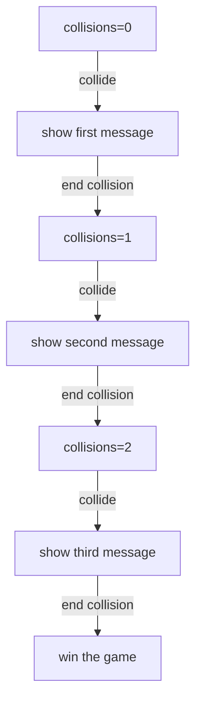

# Advanced Collisions

JetLag, via Box2D, provides many ways of customizing or even overriding the way
that collisions are handled.  This tutorial shows a few more advanced collision
options.

## Getting Started

This tutorial uses the `boundingBox()` and `enableTilt()` functions, as well as
the `sprites.json` and `sprites.png` files.  Be sure to copy them over from
previous tutorials before continuing.

Also, since the examples are likely to involve winning and losing, you'll
probably want these three lines at the top of `builder()`:

```typescript
  boundingBox();
  stage.score.onLose = { level, builder };
  stage.score.onWin = { level, builder };
```

## Sticky Actors

It can be useful to make a hero stick to an actor.  As an example, if the hero
should stand on a platform that moves along a path, then physics says that the
hero will slide on the platform as it moves left/right (unless there is a lot of
friction), and the hero will "bounce" when the platform goes from moving upward
to moving downward.  In the following example, you should move the hero onto
each platform, and watch how its behavior changes.

```iframe
{
    "width": 800,
    "height": 450,
    "src": "collisions.html?1"
}
```

To make this example, we'll start by setting up some gravity and a hero.  The
hero can move left/right via the arrow keys, and can jump via the space bar:

```typescript
    stage.world.setGravity(0, 10);
    let hero = new Actor({
      appearance: new ImageSprite({ width: 0.8, height: 0.8, img: "green_ball.png" }),
      rigidBody: new CircleBody({ cx: 0.25, cy: 5.25, radius: 0.4 }, { density: 2, disableRotation: true }),
      movement: new ManualMovement(),
      role: new Hero(),
    });
    stage.keyboard.setKeyDownHandler(KeyCodes.KEY_SPACE, () => { (hero.role as Hero).jump(0, -7.5); });
    stage.keyboard.setKeyDownHandler(KeyCodes.KEY_LEFT, () => { (hero.movement as ManualMovement).setAbsoluteVelocity(-5, hero.rigidBody.getVelocity().y); });
    stage.keyboard.setKeyUpHandler(KeyCodes.KEY_LEFT, () => { (hero.movement as ManualMovement).setAbsoluteVelocity(0, hero.rigidBody.getVelocity().y); });
    stage.keyboard.setKeyDownHandler(KeyCodes.KEY_RIGHT, () => { (hero.movement as ManualMovement).setAbsoluteVelocity(5, hero.rigidBody.getVelocity().y); });
    stage.keyboard.setKeyUpHandler(KeyCodes.KEY_RIGHT, () => { (hero.movement as ManualMovement).setAbsoluteVelocity(0, hero.rigidBody.getVelocity().y); });
```

Now we'll make a platform that moves in a diamond shape.  This platform is
sticky on top, via the `stickySides` argument to its rigid body

```typescript
    new Actor({
      appearance: new FilledBox({ width: 2, height: 0.25, fillColor: "#FF0000" }),
      rigidBody: new BoxBody({ cx: 2, cy: 6, width: 2, height: 0.25 }, { stickySides: [Sides.TOP], density: 100, friction: 0.1 }),
      movement: new PathMovement(new Path().to(2, 6).to(4, 8).to(6, 6).to(4, 4).to(2, 6), 1, true),
      role: new Obstacle(),
    });
```

Now we'll make another platform, without stickiness.  You should try to use
friction (on the hero and platform) to avoid the sliding and bouncing behaviors.
You'll probably find that it's too hard to get it to work nicely while still
having the rest of the hero movement the way you want it.

```typescript
    new Actor({
      appearance: new FilledBox({ width: 2, height: 0.25, fillColor: "#FF0000" }),
      rigidBody: new BoxBody({ cx: 11, cy: 6, width: 2, height: 0.25 }, { density: 100, friction: 1 }),
      movement: new PathMovement(new Path().to(10, 6).to(12, 8).to(14, 6).to(12, 4).to(10, 6), 1, true),
      role: new Obstacle(),
    });
```

You can make several a different side sticky, by using `Sides.BOTTOM`,
`Sides.RIGHT`, or `Sides.LEFT`.  You can also put several sides into the
`stickySides` array, by separating each with a comma.

## Disabling Collisions From One Side

In some games, we want one kind of actor to be able to "pass through" another.
For example, in this level, each of the red walls can be passed through from
three sides.  This means the hero can go through the wall in one direction, and
not the other.

```iframe
{
    "width": 800,
    "height": 450,
    "src": "collisions.html?2"
}
```

In the code for this level, each of the red walls uses `singleRigidSide` to pick
just one side that stays rigid.  The result is a sort of "box" on the screen
that is easy to get inside, and harder to get out of.

```typescript
    enableTilt(10, 10);

    new Actor({
      appearance: new ImageSprite({ width: 0.8, height: 0.8, img: "green_ball.png" }),
      rigidBody: new CircleBody({ cx: 0.25, cy: 5.25, radius: 0.4, }),
      movement: new TiltMovement(),
      role: new Hero(),
    });

    new Actor({
      appearance: new FilledBox({ width: 3, height: 0.2, fillColor: "#FF0000" }),
      rigidBody: new BoxBody({ cx: 4.5, cy: 3.1, width: 3, height: 0.2 }, { singleRigidSide: Sides.BOTTOM }),
      role: new Obstacle(),
    });

    new Actor({
      appearance: new FilledBox({ width: 0.2, height: 3, fillColor: "#FF0000" }),
      rigidBody: new BoxBody({ cx: 3.1, cy: 4.5, width: 0.2, height: 3 }, { singleRigidSide: Sides.RIGHT }),
      role: new Obstacle(),
    });

    new Actor({
      appearance: new FilledBox({ width: 0.2, height: 3, fillColor: "#FF0000" }),
      rigidBody: new BoxBody({ cx: 5.9, cy: 4.5, width: 0.2, height: 3 }, { singleRigidSide: Sides.LEFT }),
      role: new Obstacle(),
    });

    new Actor({
      appearance: new FilledBox({ width: 3, height: 0.2, fillColor: "#FF0000" }),
      rigidBody: new BoxBody({ cx: 4.5, cy: 7.5, width: 3, height: 0.2 }, { singleRigidSide: Sides.TOP }),
      role: new Obstacle(),
    });
```

There are many possibilities for this sort of wall.  For example, you might want
a trap door, or a platform that can be "jumped through".

## Disabling Collisions For Teams Of Actors

Another way we can change the behavior of collisions is by indicating that
certain combinations of actors simply do not collide with each other.  In this
example, the hero is able to move through the red wall, but the enemy cannot:

```iframe
{
    "width": 800,
    "height": 450,
    "src": "collisions.html?3"
}
```

JetLag achieves this behavior via an extra field, called `passThroughId`.  It is
an array of numbers.  If two actors have any number in common between their two
arrays, then JetLag will turn off collisions between those two actors.

```typescript
    enableTilt(10, 10);
    let h = new Actor({
      appearance: new ImageSprite({ width: 0.8, height: 0.8, img: "green_ball.png" }),
      rigidBody: new CircleBody({ cx: 0.25, cy: 5.25, radius: 0.4 }, { passThroughId: [7] }),
      movement: new TiltMovement(),
      role: new Hero(),
    });

    // the enemy chases the hero, but can't get through the wall
    new Actor({
      appearance: new ImageSprite({ width: 0.5, height: 0.5, img: "red_ball.png" }),
      rigidBody: new CircleBody({ cx: 14, cy: 2, radius: 0.25 }, { dynamic: true }),
      movement: new ChaseMovement({ speed: 1, target: h, chaseInX: true, chaseInY: true }),
      role: new Enemy(),
    });
    // Remember to make it dynamic, or it *will* go through the wall

    new Actor({
      appearance: new FilledBox({ width: 0.1, height: 7, fillColor: "#FF0000" }),
      rigidBody: new BoxBody({ cx: 12, cy: 1, width: 0.1, height: 7 }, { passThroughId: [7] }),
      role: new Obstacle(),
    });
```

A nice aspect of this design is that you can use many different numbers to
represent many different rules.  For example, maybe enemies should pass through
obstacles, obstacles through heroes, heroes through goodies, and goodies through
destinations.  Using a different number for each rule, and two numbers per
actor, would let you express these behaviors.

## Combining Stickiness With Rigid Sides

In this next example, we do a quick test to make sure that the ideas we've seen
so far *compose*.  It should be possible to jump through the bottom of the
leftmost platform, and then stick to its top:

```iframe
{
    "width": 800,
    "height": 450,
    "src": "collisions.html?4"
}
```

Compared to before, the only difference from before is when we make the rigid
body for the platform on the left:

```typescript
      rigidBody: new BoxBody({ cx: 2, cy: 6, width: 2, height: 0.25, }, { stickySides: [Sides.TOP], singleRigidSide: Sides.TOP, density: 100, friction: 0.1 }),
```

## Responding To The End Of A Collision

Everything we've looked at so far deals with when collisions *start*. Sometimes,
we want to do something when the collision *ends*.  In this example, each time
the hero collides with the obstacle, it puts a different message on the screen.
You can think of this as the start of the kind of interaction you might have in
an RPG style of game.

```iframe
{
    "width": 800,
    "height": 450,
    "src": "collisions.html?5"
}
```

The first part of this code just sets up the hero:

```typescript
    enableTilt(10, 10);
    let h = new Actor({
      appearance: new ImageSprite({ width: 0.8, height: 0.8, img: "green_ball.png" }),
      rigidBody: new CircleBody({ cx: 2, cy: 3, radius: 0.4, }),
      movement: new TiltMovement(),
      role: new Hero(),
    });
```

There are two things to understand about the rest of the code.  The first is
that we're going to make an ad hoc state machine.  We'll accomplish it using a
number and an array of messages:



Next, let's think about how to get the behavior we want.  When the hero collides
with the obstacle, we'll set up an "end contact" handler.  This code will run
when the hero and obstacle stop being in a collided state.  If they collide
again, we'll need to add a new "end contact" handler, but fortunately, the code
is the same (it's just the value of `collisions` that will change).

Putting it all together, the rest of the example looks like this:

```typescript
    let collisions = 0;
    let messages = ["Please leave me alone", "Why do you bother me so?", "Fine, you win."]
    let o = new Actor({
      appearance: new ImageSprite({ width: 0.8, height: 0.8, img: "mustard_ball.png" }),
      rigidBody: new CircleBody({ cx: 15, cy: 8, radius: 0.4 }),
      role: new Obstacle({
        heroCollision: () => {
          let text = new Actor({
            appearance: new TextSprite({ center: false, face: "Arial", size: 30, color: "#FF00FF" }, () => messages[collisions]),
            rigidBody: new BoxBody({ cx: 12, cy: 6, width: .01, height: .01 })
          });
          (stage.world.physics as AdvancedCollisionSystem).addEndContactHandler(o, h, () => {
            collisions++;
            text.remove();
            if (collisions == 3) stage.score.winLevel();
          });
        }
      }),
    });
```

## Wrapping Up

In this tutorial, we saw ways of either *not* using a collision, or using a
collision differently than what was possible in the previous tutorials.  Perhaps
the most important point is that none of these features was part of my original
design for JetLag... they all came later, in response to needs that students
raised.  If you think you need a new feature in JetLag, please contact me!

```md-config
page-title = Advanced Collisions
img {display: block; margin: auto; max-width: 75%;}
.max500 img {max-width: 500px}
.red {color: red}
```
