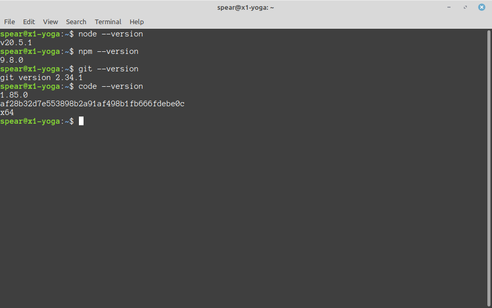
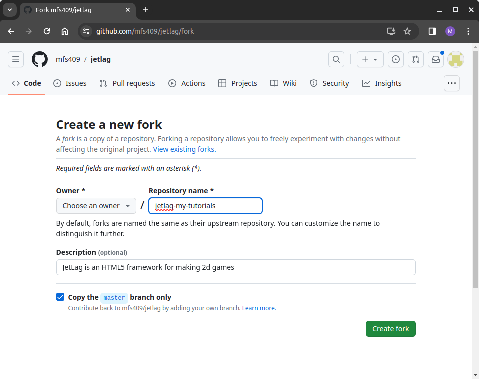
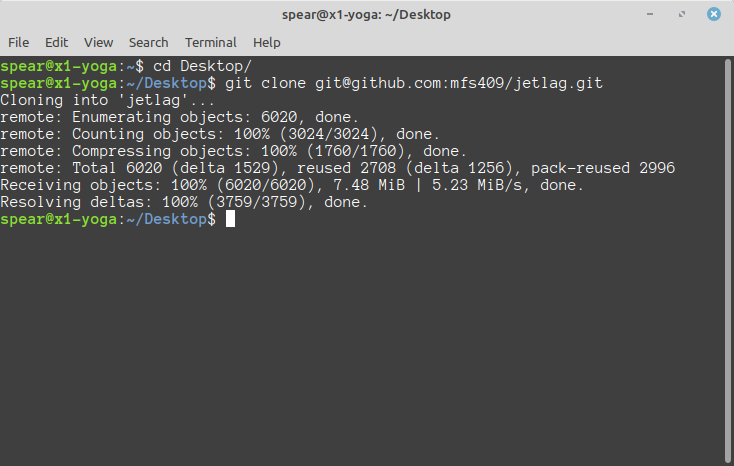
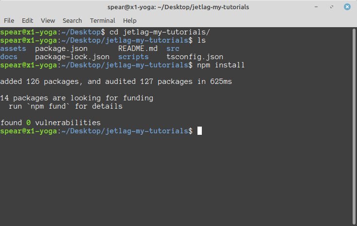
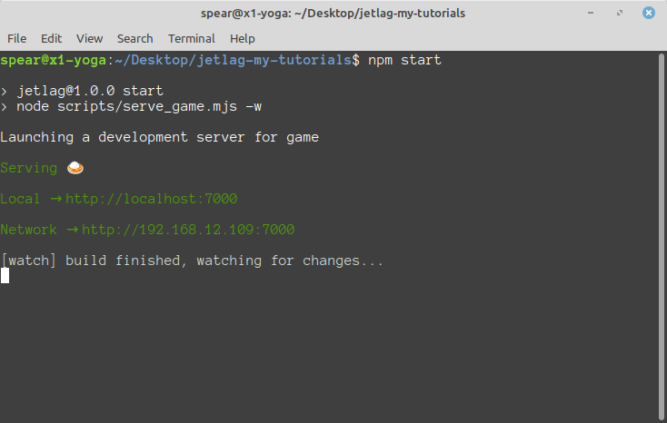
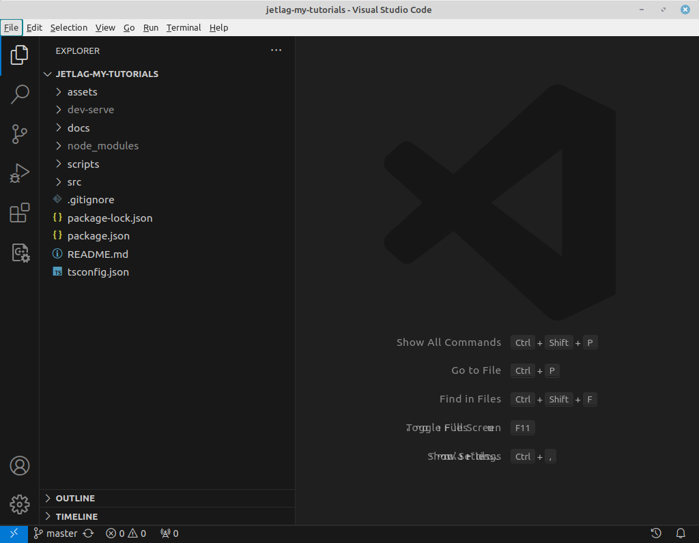

# Getting Started

In this tutorial, we will discuss how to get started using JetLag.  This
tutorial doesn't involve much programming.  It only focuses on getting your
computer set up to start writing games.  When you finish this tutorial, you will
have a copy of the JetLag code that you are able to run.  You will be able to
use this as the starting point for learning about games, and also as the
starting point for making your own game.

## Required Software

You will need the following programs in order to work with JetLag.  Please note
that we do not currently support development on phones or ChromeBooks:

- A terminal and `git`
    - Every major operating system has at least one terminal program (some even
      have more than one).  It should not matter which terminal you use, but you
      will need to have the `git` program installed.  Briefly, `git` is a
      *source control* tool.  At a minimum, you'll use it to get a copy of the
      starter code.  In most cases, you'll want to use `git` to manage your code
      as you develop it.
- Node.js (`node`) and the Node Package Manager (`npm`)
    - JetLag uses `node` and `npm` to transform your code into a format that can
      be tested inside a browser.  Note: you probably want to use the "LTS"
      version of node.js.
- A web browser
    - Any modern browser should suffice.  JetLag has been tested on Chrome,
      Edge, and Firefox.
- An editor
    - Strictly speaking, any program that can edit text will suffice.  However,
      since JetLag uses TypeScript, you will probably find that Visual Studio
      Code ("VSCode") offers many benefits and makes your experience much nicer.

Below are links to tutorials for helping you to install these programs.

- Windows Instructions
    - [Git Bash for Windows](https://www.educative.io/answers/how-to-install-git-bash-in-windows)
    - [Visual Studio Code](https://code.visualstudio.com/docs/setup/windows)
    - [Node.js and NPM](https://www.geeksforgeeks.org/installation-of-node-js-on-windows/)

- MacOS Instructions
    - [Git](https://git-scm.com/book/en/v2/Getting-Started-Installing-Git)
    - [Visual Studio Code](https://code.visualstudio.com/docs/setup/mac)
    - [Node.js and NPM](https://nodejs.org/en/download/package-manager#macos)

To be sure that you have everything configured correctly, open a terminal and
type the command `node --version`.  Then type `npm --version`.  Then type `git
--version`.  Then type `code --version`.  Your output should look something like
this:



## Extra Software Configuration

If this is your first time installing `git`, you may need to do a little bit of
additional configuration.  Type the following commands in your terminal (Note:
you should use *your* name and email):

```bash
git config --global init.defaultBranch main
git config --global user.email "rsmith123@some.email.address.com"
git config --global user.name "Riley Smith"
git config --global pull.rebase false
```

You will also want to do a little bit of configuration in VSCode.  You can get
to the settings in VSCode by pressing `F1`, typing `settings` into the search
box, and then choosing "Open Settings (UI)".

- Using the search bar, find "Editor: **Format On Save**" and set it to true.
- Then find "Typescript > Format: **Enable**" and be sure to check it.

## Getting the JetLag Code

The JetLag starter code is hosted on GitHub.  The easiest way to get started is
to "fork" the JetLag repository on GitHub.  If you don't have a GitHub account,
you should visit <GitHub.com> to create a count.  Then go to
<https://github.com/mfs409/jetlag> and click the "fork" button.  You should
change the name from JetLag to the name of your game (for our tutorials, the
name `jetlag-my-tutorials` might be a good choice of name).



If this all sounds strange, don't worry, it's very common.  When you "fork" a
repository, you are essentially saying "give me a copy of the repository that I
can edit."  There are two very nice aspects of forking:

- Your code is *also* on GitHub, which means you can back up your code any time
  you want and save it to the cloud.
- You can still get updates from the repository you forked.  So whenever I
  update JetLag, you can "pull" from my version into yours, to get the latest
  features.

If git seems daunting, you may want to read my [Git
tutorial](https://www.cse.lehigh.edu/~spear/tutorials/viewer.html#cse216_git/tut.md).

After you've got a GitHub account, you will also need to set up "ssh keys".
These provide a secure way of interacting with GitHub.  For help, see [these
instructions](https://docs.github.com/en/authentication/connecting-to-github-with-ssh/adding-a-new-ssh-key-to-your-github-account).
link.

## Running for the First Time

Now that you've forked the repository, it's time to "clone" it.  Cloning refers
to copying your repository from the cloud onto your development machine.  When
you make changes to your code, they won't go to the cloud automatically.
Instead, you can periodically "commit" snapshots of your code, and then "push"
them to GitHub.  This means that you can work through something, and only back
it up to GitHub when you're sure it's good.

Navigate to the GitHub website, go to your projects, and click the green "Code"
button.  There will be an "ssh" option, and a corresponding statement like
`git@github.com:my-username/jetlag-my-tutorials.git`.  Copy this text.

Next, open a terminal and go to the place where you want to check out your code.
I'll be lazy in this tutorial, and check out the code to my Desktop folder.  So
from the terminal, I would type `cd Desktop` to go from my home folder into the
desktop folder.  You can, of course, go to any folder that makes sense.

Now type `git clone XXX`, where `XXX` is the text that you copied from the
GitHub website (in my case, I'd type `git clone
git@github.com:my-username/jetlag-my-tutorials.git`).  This will take a minute to
copy all the code from your fork of my repository.  It will put everything in a
subfolder of the current folder (so, in my case, `Desktop/jetlag-my-tutorials`).
To go into that folder, type `cd jetlag-my-tutorials`.



If you list the files in that folder (by typing `ls`), you'll see that the code
is all there.  But it's not ready to use.  The problem is that JetLag relies on
some *other* code.  If you type `npm install`, then the rest of the code that
you need will be copied to your computer.



To test out the code, type `npm start`.  You should see something like the
following:



There is a line that says something like `Local → http://localhost:7000`.  This
means that your game is ready to test out.  Open a web browser and go to the
address that appears after the arrow (so, in my case, `http://localhost:7000`).
You should see something like this:


Congratulations!  Your game is up and running.

## About the Code

Next, let's open up the code in VSCode.  When you work in VSCode, it is useful
to think about *folders*, not just *files*.  In our case, that means you will
want to use VSCode to open the *folder* that is the root of your checkout.  You
can either do this by opening VSCode and then going to `File/Open Folder`, or
from the terminal, by going into the folder you want to view and then typing
`code .` (don't forget the period!).  Either way, you should then see something
like this:



(Note: If the left side panel is collapsed, click the topmost icon in the left
icon bar).

On the left, you'll see a few files and folders:

- `assets` - This is where you should put any images, sounds, or other files
  that support your game.
- `dev-serve` - You can ignore this.  It's where `node` puts stuff while you're
  testing your code.
- `docs` - This is a copy of the JetLag documentation, which is also available
  at <https://mfs409.github.io/jetlag/>
- `node_modules` - You can ignore this.  It's where `npm` puts the things it
  needs in order for your game to work.
- `scripts` - You can ignore this.  It's just has some code for helping `npm``
  to know how to run your code
- `src` - This has two sub-folders.  `src/jetlag` is where the JetLag code can
  be found.  `src/game` is where your game code should go.
- `.gitignore` - This file tells `git` that some folders and files, such as
  `node_modules` and `dev-serve`, shouldn't get backed up to GitHub.
- `package-lock.json` - This file is created by `npm`.  You can ignore it.
- `package.json` - This file is used by `npm`.  You probably won't need to work
  with this until your game gets very advanced.
- `README.md` - A file describing the repository.  For now, it describes
  JetLag itself, but you may eventually change it.
- `tsconfig.json` - Another configuration file that you can ignore for a long
  time.

If that all seems daunting or confusing, don't worry.  When you're just starting
out, pretty much all that matters is that there is a folder called `src/game`,
with two files: `game.html` and `game.ts`.  In the next tutorial, we'll look at
how to start changing the code in these files to make your own game.
