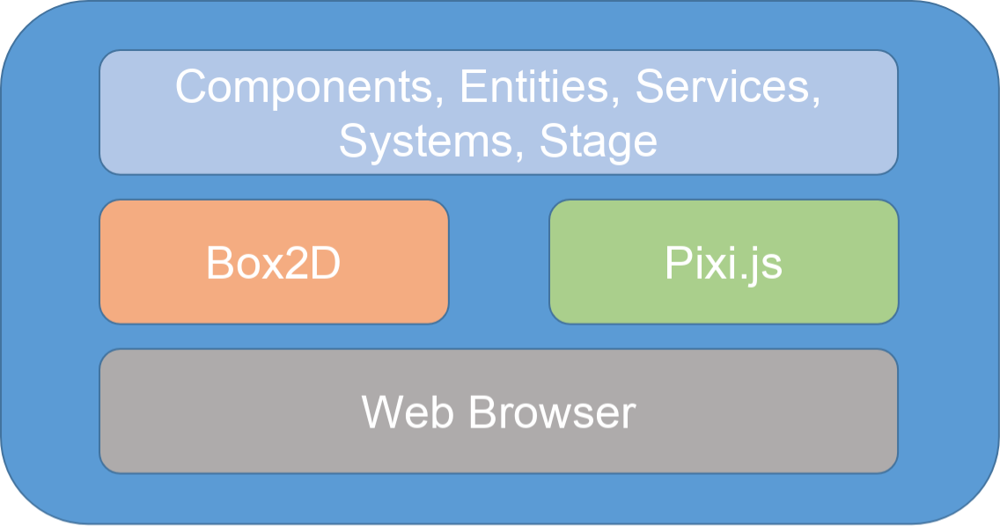
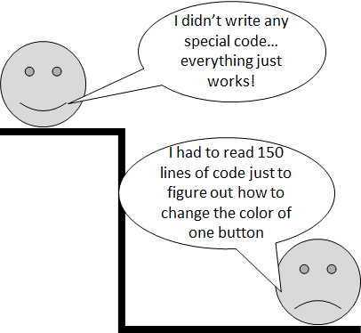
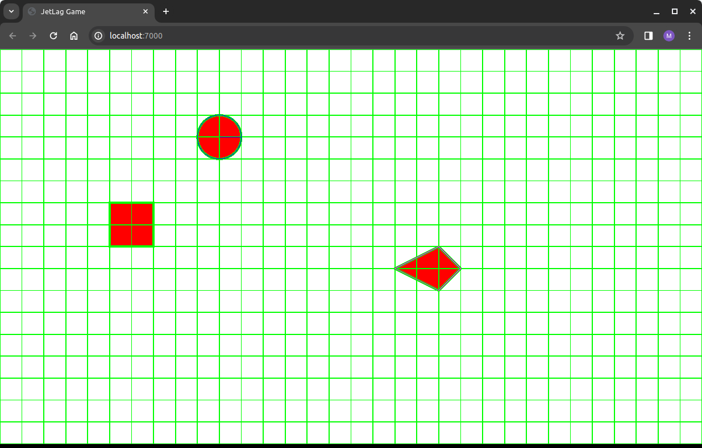
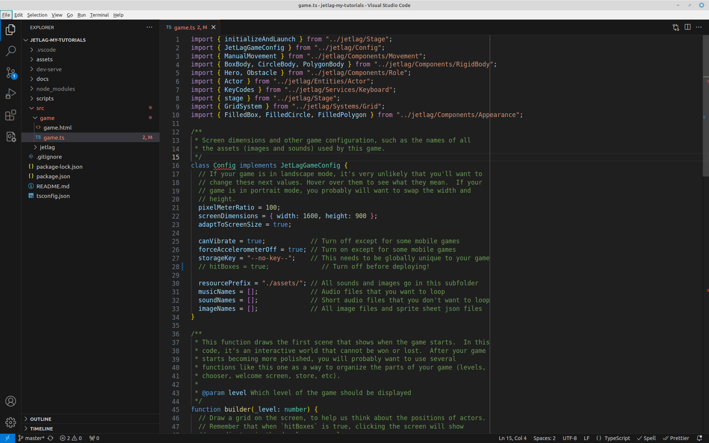
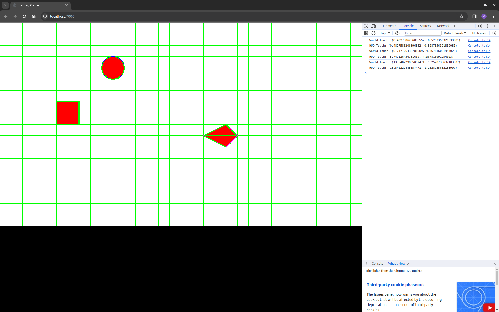

# An Overview of JetLag

This tutorial gives a high-level overview of JetLag.  It briefly describes some
of the main concepts that you will want to understand as you learn about game
development, and then it explains how the default game works.

## Software Foundations

There is very little software that doesn't rely on other software.  When someone
writes code and shares it, with the expectation that other people will use that
code (but not modify it!), we call their code a "library".

JetLag relies on two important libraries.  The first is Box2D.  Box2D is an
industrial-strength physics simulator.  A programmer can use Box2D to create a
"world", put shapes into that world, and then see how those shapes move and
collide.  The second important library is Pixi.js.  Pixi.js is a library for
drawing 2D images.  Note that Box2D doesn't know anything about drawing, and
Pixi.js doesn't know anything about physics.  However, they both do know about
shapes, such as circles, rectangles, and polygons.

Pixi.js and Box2D are general-purpose libraries... they can be used to make
games, but also for many other purposes.  The main goal of JetLag is to provide
a clean and easy way to develop games, by providing a game-specific interface to
Pixi.js and Box2D.  JetLag tries to give you common building blocks for making
games.  These building blocks should be easier to use than working with Box2D
and Pixi.js directly.  Another goal is that you should still be able to reach
down into the full power of Pixi.js and Box2D when you need to.

The following picture gives a sense for how everything fits together:

@@max500 @@

At the top-most level, JetLag provides Components, Entities, Services, Systems,
and a Stage, which represent the key parts of your game.  We're going to discuss
these in this tutorial.  These pieces of JetLag are built from Box2D and
Pixi.js, which are in the middle level. JetLag hides all the details of Box2D
and Pixi.js, so that it's not overwhelming to get started writing games.
Finally, at the bottom, Pixi.js and Box2D interact with a web browser, which
displays the game, receives input, etc.

One way in which JetLag is different than many libraries is that we expect each
game to end up customizing JetLag at some point.  When you write a game with
JetLag, you copy the JetLag code into your folder, right next to the code you
write. That way, when things start to get complicated, and you need to use more
of the power of Box2D and Pixi.js, you can make changes to JetLag that make
those features visible.  One important aspect of this design is that your code
can evolve over time, gradually using more and more of Box2D and Pixi.js.  This
design will help you to avoid the problem illustrated in the next picture:



Before we look at some code, there is one more important topic to discuss.  If
you're looking at that first picture and thinking "I don't want my game to run
in a web browser", JetLag is still a good tool for you.  In later tutorials,
we'll show you how to use tools like [Capacitor](https://capacitorjs.com/) and
[Electron](https://www.electronjs.org/) to run your game as a mobile or desktop
app.

## The Parts of the Default Game

Let's start by trying to understand the default game that comes with JetLag.
When you cloned the last tutorial and ran the game, you should have seen
something like this:



Our goal right now is to understand why.  There are two important files.  The
first is `src/game/game.html`.  It is the file that defines the structure of the
web page that you're seeing in your browser.  If you open it in VSCode, you
should see something like this:

```html
<!DOCTYPE html>
<html lang="en">

<head>
  <meta charset="UTF-8">
  <meta http-equiv="X-UA-Compatible" content="IE=edge">
  <meta name="viewport" content="width=device-width, initial-scale=1, shrink-to-fit=no">
  <style>
    html,
    body {
      background-color: #000;
      height: 100%;
      overflow: hidden;
      margin: 0;
      padding: 0;
    }
  </style>
  <title>JetLag Game</title>
</head>

<body>
  <div style="text-align:center">
    <div id="game-player"></div>
  </div>
  <script src="./game.js"></script>
</body>

</html>
```

The `head` section describes the general appearance of the web page.  It has
some `meta` tags that explain how mobile web browsers should scale the page so
it looks good on a small screen.  It has a `style` tag, which makes sure that
the page fills the screen.  Finally, it has a `title`, which is what appears as
your game name in the browser tab or browser title bar.  The first thing you
should do whenever you start making a new game is update the title.

The `body` only has two parts.  The first is the pair of `div` tags, which
define a `game-player`.  Right now, `game-player` doesn't mean anything.  When
we get to the `game.ts` file, we'll see why it matters.  The other thing is a
`script` tag.  This tells the web browser that the code to run will be called
`game.js`.  You probably don't want to change anything in the `body` section of
this file.

Now let's move on to the second file.  It is called `sra/game/game.ts`.  First
of all, notice that it is not `game.js`.  That's because it *only* has the code
that you write, not all of the JetLag stuff (and Pixi.js stuff, and Box2D
stuff).  When you type `npm start`, then `game.ts` gets combined with all those
other things to produce the `game.js` file that the web page expects.

There are four important parts of `game.ts`.  The first is a set of `import`
statements that appear at the top of the file.  These indicate which parts of
JetLag your game needs.  For now, you can just leave them as-is.  Later, you'll
learn how to get VSCode to automatically update the imports as you start using
new features of JetLag.  That part of the file should look like this:

```typescript
import { initializeAndLaunch } from "../jetlag/Stage";
import { JetLagGameConfig } from "../jetlag/Config";
import { ManualMovement } from "../jetlag/Components/Movement";
import { BoxBody, CircleBody, PolygonBody } from "../jetlag/Components/RigidBody";
import { Hero, Obstacle } from "../jetlag/Components/Role";
import { Actor } from "../jetlag/Entities/Actor";
import { KeyCodes } from "../jetlag/Services/Keyboard";
import { stage } from "../jetlag/Stage";
import { GridSystem } from "../jetlag/Systems/Grid";
import { FilledBox, FilledCircle, FilledPolygon } from "../jetlag/Components/Appearance";
```

The second part of the file is where we configure our game.  You'll notice that
some parts of this code are green.  Any text that comes after `//` or between
`/*` and `*/` is called a "comment".  Comments are not real code.  They are
notes that a programmer can put into the code to explain what it does, how it
works, etc.  In this part of the code, you'll see a lot of comments to help
explain what each line means.

```typescript
/**
 * Screen dimensions and other game configuration, such as the names of all
 * the assets (images and sounds) used by this game.
 */
class Config implements JetLagGameConfig {
  // If your game is in landscape mode, it's very unlikely that you'll want to
  // change these next values. Hover over them to see what they mean.  If your
  // game is in portrait mode, you probably will want to swap the width and
  // height.
  pixelMeterRatio = 100;
  screenDimensions = { width: 1600, height: 900 };
  adaptToScreenSize = true;

  canVibrate = true;            // Turn off except for some mobile games
  forceAccelerometerOff = true; // Turn on except for some mobile games
  storageKey = "--no-key--";    // This needs to be globally unique to your game
  hitBoxes = true;              // Turn off before deploying!

  resourcePrefix = "./assets/"; // All sounds and images go in this subfolder
  musicNames = [];              // Audio files that you want to loop
  soundNames = [];              // Short audio files that you don't want to loop
  imageNames = [];              // All image files and sprite sheet json files
}
```

One important thing is that all of this code is defined as a `class` that
`implements` something called `GameConfig`.  All that really means is that I've
made sure that if you forget any of the required parts of the configuration, you
will get an error.  You can try it out.  Put `//` in front of one of the lines
(perhaps `hitboxes`) and watch what happens.  `Config` gets a red underline, and
if you hover your mouse over it, you'll see an error message.



Most of the time, the only things you'll want to change in this part of the code
are the asset names (`musicNames`, `soundNames`, and `imageNames`).  When you
start using JetLag's storage features, you will also need to update the
`storageKey`, but we won't worry about that for now.  And when you're ready to
launch your game, you'll want to set `hitBoxes = false`, but we're not ready to
do that yet!

The third part of the file is where we put our actual game code.  In later
tutorials, we'll learn how to split this apart, since a game's code can get
quite long.  We'll look at this code in more detail in the next section of the
tutorial.  For now, what matters is that it is a "function".  A function is a
block of code that we can run any time we want.  It turns out that JetLag itself
will decide when to call this function.  The function takes an argument called
`level`, which lets it do different things depending on which level of the game
is being drawn.  Our function only draws one level, so we prefix `level` with an
`_`, to indicate that we aren't going to use it.

Remember that this function creates the *initial state* of the game.  It runs to
completion before you get to play the game, and anything that happens during
gameplay is because of decisions the physics simulator makes, or events that
occur.

```typescript
/**
 * This function draws the first scene that shows when the game starts.  In this
 * code, it's an interactive world that cannot be won or lost.  After your game
 * starts becoming more polished, you will probably want to use several
 * functions like this one as a way to organize the parts of your game (levels,
 * chooser, welcome screen, store, etc).
 *
 * @param level Which level of the game should be displayed
 */
function builder(_level: number) {
  // Draw a grid on the screen, to help us think about the positions of actors.
  // Remember that when `hitBoxes` is true, clicking the screen will show
  // coordinates in the developer console.
  GridSystem.makeGrid(stage.world, { x: 0, y: 0 }, { x: 16, y: 9 });

  // Make a "hero" who moves via keyboard control and appears as a circle
  let hero = new Actor({
    appearance: new FilledCircle({ radius: .5, fillColor: "#ff0000", lineWidth: 4, lineColor: "#00ff00" }),
    rigidBody: new CircleBody({ cx: 5, cy: 2, radius: .5 }),
    role: new Hero(),
    movement: new ManualMovement(),
  })

  // Make an obstacle that is a rectangle
  new Actor({
    rigidBody: new BoxBody({ cx: 3, cy: 4, width: 1, height: 1 }),
    appearance: new FilledBox({ width: 1, height: 1, fillColor: "#ff0000", lineWidth: 4, lineColor: "#00ff00" }),
    role: new Obstacle(),
  })

  // Make an obstacle that is a polygon
  new Actor({
    rigidBody: new PolygonBody({ cx: 10, cy: 5, vertices: [0, -.5, .5, 0, 0, .5, -1, 0] }),
    appearance: new FilledPolygon({ vertices: [0, -.5, .5, 0, 0, .5, -1, 0], fillColor: "#ff0000", lineWidth: 4, lineColor: "#00ff00" }),
    role: new Obstacle(),
  })

  // Pressing a key will change the hero's velocity
  stage.keyboard.setKeyUpHandler(KeyCodes.KEY_UP, () => (hero.movement as ManualMovement).updateYVelocity(0));
  stage.keyboard.setKeyUpHandler(KeyCodes.KEY_DOWN, () => (hero.movement as ManualMovement).updateYVelocity(0));
  stage.keyboard.setKeyUpHandler(KeyCodes.KEY_LEFT, () => (hero.movement as ManualMovement).updateXVelocity(0));
  stage.keyboard.setKeyUpHandler(KeyCodes.KEY_RIGHT, () => (hero.movement as ManualMovement).updateXVelocity(0));
  stage.keyboard.setKeyDownHandler(KeyCodes.KEY_UP, () => (hero.movement as ManualMovement).updateYVelocity(-5));
  stage.keyboard.setKeyDownHandler(KeyCodes.KEY_DOWN, () => (hero.movement as ManualMovement).updateYVelocity(5));
  stage.keyboard.setKeyDownHandler(KeyCodes.KEY_LEFT, () => (hero.movement as ManualMovement).updateXVelocity(-5));
  stage.keyboard.setKeyDownHandler(KeyCodes.KEY_RIGHT, () => (hero.movement as ManualMovement).updateXVelocity(5));
}
```

The last part of the file is a call to `initializeAndLaunch`.  This is what
leads to your game actually running.  You'll notice that we have the name of the
`div` from the HTML file in here.  In essence, this says "find that div, make a
game according to the rules in `Config` and `builder`, and then put the game
into that div".

```typescript
// call the function that starts running the game in the `game-player` div tag
// of `index.html`
initializeAndLaunch("game-player", new Config(), builder);
```

One last note: you can change names like `Config` and `builder`, but when you
do, make sure you change them everywhere!

## A Game is Like an Interactive Play

At this point, we've looked at everything except the code that actually makes
our game different from any other game.  Part of what makes JetLag approachable
is the way it organizes code.  JetLag organizes everything around the metaphor
of a theater production.

It is helpful to think about a game in the same way you might think about
filming the kind of play where the actors get input from the audience.  The
first thing that you will need is to have a stage, which is where all the action
happens. That stage can be thought of as the place where some fictional "world"
comes to life.

On that stage, you will need to put some actors.  They're going to do the things
that make the game fun to play / make the play entertaining to watch.  The stage
will probably also have some props on it.  It turns out that in games, the line
between actors and props is kind of blurry, so we're just going to call
everything an actor.

Each level of your game is like an act or scene of the play.  When a level
starts, some actors will be pre-positioned on the stage.  They'll start doing
whatever the script says that they should do.  Then events will happen, which
drive the action forward.  

In JetLag, our focus is on the kind of games where a physics simulator (Box2D)
drives the action forward.  So in the above paragraph, "whatever the script says
that they should do" really means "whatever the physics simulator says they
should do".  If an actor is initially configured to be stationary, it won't
move.  If it's configured to move at a fixed speed, or fall from the sky,
subject to some gravitational force, then that's what it will do.

If that's all we have, then your game won't be very fun... it will play the
exact same way, every time, and will completely ignore whatever the person
playing the game is trying to do.  *Events* are the way that we interrupt the
simulation and change it.  In JetLag, there are three kinds of events:

- Collisions: When two actors collide with each other, you can use that
  collision as an opportunity to run some code.
- Timers: You can request that some code run after a certain amount of time
  elapses.
- User input: You can provide code to run in response to user gestures, clicks,
  keyboard presses, etc.

In the rest of this tutorial, the terms "script" and "callback" will be used
interchangeably to refer to the code that you provide, that runs in response to
events.  The purpose of that code is to change the state of the physics
simulation.

Surprisingly, that's all there is to a game.  It's just a physics simulation
that you can interact with.  You can think of it like a play, where the "player"
is an audience member who can change what happens in the play.

## Breaking Down the Builder

Now let's look at what's happening inside of the `builder` function.

### The Grid

Like most game engines, JetLag uses the Entity-Component-System (ECS) pattern.
Every actor in the game is an "Entity", and has certain special "Components"
attached to it.  These components give actors different behaviors and
appearances.  "Systems" are kind of vague, but you can think of a System as
being something that manages many entities.

The first thing you'll see in the game is this line:

```typescript
  // Draw a grid on the screen, to help us think about the positions of actors.
  // Remember that when `hitBoxes` is true, clicking the screen will show
  // coordinates in the developer console.
  GridSystem.makeGrid(stage.world, { x: 0, y: 0 }, { x: 16, y: 9 });
```

This draws the grid that you see on the screen.  If you open the developer
console in your browser (in Chrome or Firefox: press F12, then pick console),
and then click anywhere on the screen, you should see that the coordinates of
your click are reported in the console:



Right now, "World Touch" and "HUD Touch" are the same.  We'll get to this in a
later tutorial.  For now, you can ignore "HUD Touch".

It turns out that the GridSystem is making lots and lots of lines.  Each of them
is an Actor, but they're more like props than anything else... they don't move,
and they don't get in the way of the things that can move.  The Grid is just
there to help you when you get started, so let's not think about it in any more
detail.

What is much more interesting is how the world relates to our `Config` object.
The Config object asked for a screen that was 1600x900 meters, with a
pixel-to-meter ratio of 100.  It also asked to adapt to the screen size.  If you
resize your browser and refresh, you'll see that the game resizes, so it is
always going to be in a 16x9 ratio (with black bars on the left/right or
top/bottom, as necessary).  No matter what size your browser window, the game
will be scaled so that it shows a simulated world that is 16x9 meters.

### The Hero

Actors are the main kind of entity in JetLag.  The lines of the Grid were
actually actors, but it's not really useful to think about them like that,
because they're just there as a guide while we're getting started.  

Instead, let's look at the three clusters of code that make Actors, since they
are the ones that make this "game" interesting.  Every Actor must have an
appearance and a rigidBody.  There are other components that can be added, but
they're optional.  

Let's look at the first actor:

```typescript
  // Make a "hero" who moves via keyboard control and appears as a circle
  let hero = new Actor({
    appearance: new FilledCircle({ radius: .5, fillColor: "#ff0000", lineWidth: 4, lineColor: "#00ff00" }),
    rigidBody: new CircleBody({ cx: 5, cy: 2, radius: .5 }),
    role: new Hero(),
    movement: new ManualMovement(),
  })
```

In this code we are making an actor.  This actor is going to get used in some
code later, so we give it a name (`hero`) so that it is easy to keep track of
it. For its appearance, we make a circle with radius .5, which means it will
have a width of 1 and a height of 1.  We color it red (`#FF0000`), and give it a
green border that is 4 pixels wide.

We make the body as a circle that also has radius .5.  We could have the
appearance be something other than a circle, or a circle with a different
radius, but in this game, that wouldn't be useful.  The `cx` and `cy` values
specify the coordinates of the center of the circle.  Remember that the top-left
corner of the world is (0, 0), with X increasing as we move left, and Y
increasing as we move down.

This actor's role is `Hero`.  Usually the hero is the focal point of the game.
In this game, all that means is that the hero isn't a prop... by default,
heroes' rigidBody components will collide with other things that can are
supposed to collide.  (The grid didn't have a role, so it doesn't collide with
the hero.  The obstacles (below) have roles that cause them to collide with the
hero.)

The last component we attached to this actor is its movement.  The
`ManualMovement` component indicates that we're going to use code to manually
move this actor around.  That will be important when we get to the last part of
the code.

### The Obstacles

The next part of the code makes two obstacles.  They are actors, but they don't
have a `movement`, so we should expect that they're not going to be able to
move.  Looking at these, we see that they follow the same pattern as the hero,
but we don't assign them to variables (because we don't want to make changes to
them later).  One has a box shape, and the other has a polygon shape.

```typescript
  // Make an obstacle that is a rectangle
  new Actor({
    rigidBody: new BoxBody({ cx: 3, cy: 4, width: 1, height: 1 }),
    appearance: new FilledBox({ width: 1, height: 1, fillColor: "#ff0000", lineWidth: 4, lineColor: "#00ff00" }),
    role: new Obstacle(),
  })

  // Make an obstacle that is a polygon
  new Actor({
    rigidBody: new PolygonBody({ cx: 10, cy: 5, vertices: [0, -.5, .5, 0, 0, .5, -1, 0] }),
    appearance: new FilledPolygon({ vertices: [0, -.5, .5, 0, 0, .5, -1, 0], fillColor: "#ff0000", lineWidth: 4, lineColor: "#00ff00" }),
    role: new Obstacle(),
  })
```

Boxes are pretty easy to understand: they just have a width and a height.  But
that polygon is kind of tricky.  Polygons must be convex, and we define them by
providing the (x,y) coordinates of their vertices, in clockwise order.  These
coordinates are relative to the center of the polygon.  So in this code, we're
saying that one point is at (0, -.5) relative to the center, the next is at (.5,
0), the next at (0, .5), and the last at (-1, 0).  These are the left, top,
right, and bottom vertices, respectively.  Note, again, that we make the
`rigidBody` and the `appearance` identical.

Finally, each of these obstacles has a role of `Obstacle`.  For now, that just
means "the hero can collide with it".

One quick note: the appearance right now is pretty bland, because we're just
drawing solid shapes.  In a later tutorial, you'll see that we can use pictures,
or animations (sequences of pictures), to make a much more visually appealing
game.

### Events

If we ran the game as-is, nothing would happen... the world would just stay
stationary forever.  That's not going to be very fun, so the last part of the
code is going to make it possible for the player to control the hero.  We do
this through events.

```typescript
  // Pressing a key will change the hero's velocity
  stage.keyboard.setKeyUpHandler(KeyCodes.KEY_UP, () => (hero.movement as ManualMovement).updateYVelocity(0));
  stage.keyboard.setKeyUpHandler(KeyCodes.KEY_DOWN, () => (hero.movement as ManualMovement).updateYVelocity(0));
  stage.keyboard.setKeyUpHandler(KeyCodes.KEY_LEFT, () => (hero.movement as ManualMovement).updateXVelocity(0));
  stage.keyboard.setKeyUpHandler(KeyCodes.KEY_RIGHT, () => (hero.movement as ManualMovement).updateXVelocity(0));
  stage.keyboard.setKeyDownHandler(KeyCodes.KEY_UP, () => (hero.movement as ManualMovement).updateYVelocity(-5));
  stage.keyboard.setKeyDownHandler(KeyCodes.KEY_DOWN, () => (hero.movement as ManualMovement).updateYVelocity(5));
  stage.keyboard.setKeyDownHandler(KeyCodes.KEY_LEFT, () => (hero.movement as ManualMovement).updateXVelocity(-5));
  stage.keyboard.setKeyDownHandler(KeyCodes.KEY_RIGHT, () => (hero.movement as ManualMovement).updateXVelocity(5));
```

In the above code, we are dealing with two kinds of events: keyboard
down-presses of keys, and keyboard up-presses of keys.  If you hover your mouse
over `setKeyUpHandler`` in VSCode, you should see some pop-up help.  In fact,
you should be able to hover over just about *anything* in the code and get help.
In this case, the help says that we are providing code to run whenever some key
is up-pressed (that is, when the key is released).

We are using the TypeScript language, and in TypeScript, we can make functions
any time we want, by using syntax of the form `()=>{}`.  Sometimes we can
simplify this slightly, to `()=>code`, when the code is just one line.  So in
this case, we have eight lines of code, which say that for each arrow key, we'll
provide code to run when the key is pressed and when the key is released.

In each case, we'll update the hero's velocity (via its movement component)
according to the key press.

In the window below, you'll find an embedded, playable version of the game.  Be
sure to click it, then use the arrow keys.  The hero should move around, and
should collide with the obstacles.  You might also want to turn on the developer
console as you play, to see messages as you click the screen.

```iframe
{
    "width": 800,
    "height": 450,
    "src": "/getting_started.html"
}
```

In the above code, I kind of glossed over one thing: the "stage".  You can think
of the stage as an Entity, but a special one... there's only one stage in the
game, and it has special features that actors don't have.  In this case, it's
the only thing that understands keyboard events, via `stage.keyboard`.  We'll
explore this in further detail in later tutorials.

## Next Steps

If you have been following along in your code, now would be a great time to try
to make some changes.  You might want to change the positions of the actors, or
change their dimensions.  Perhaps you want to change their appearance, maybe
even making the appearance different from the underlying rigidBody.  You could
also change the key behavior (for example, by increasing or decreasing the
velocity).  At some point, you might also want to set `hitBoxes` to `false`, to
see how everything's appearance changes, and becomes much cleaner!

```md-config
page-title = An Overview of JetLag
img {display: block; margin: auto; max-width: 75%;}
.max500 img {max-width: 500px}
```
