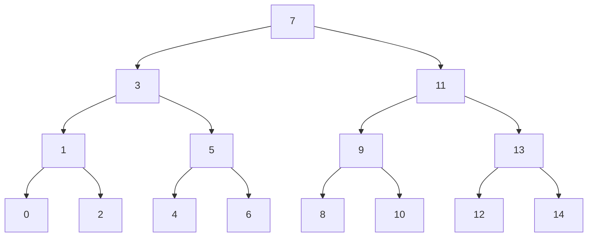

# Lehigh Intelligent and Scalable Systems Research Experience for Undergraduates

## Tutorial: Introduction to Markdown

Markdown is a language for formatting text.  Its name alludes to the **M** in
**HTML**: HyperText Markup Language.  But where HTML has become somewhat complex
and cumbersome to work with, markdown tends to remain lightweight.

The main idea behind markdown is that we can take a text document, add a small
amount of special characters in and around parts of our document, and *voila*,
we'll have a much more beautiful document that is easier to read.  Better yet,
when we look at the source of the document (as plain text), it's still easy to
read.

### Test Iframe

```iframe
{
  "width": "100%",
  "height": "100px",
  "class": "red",
  "src": "https://www.cse.lehigh.edu/~spear/"
}
```

### An Example

Let's consider a simple example.  Suppose we wanted to have a document with the
following list:

* *Dog*
* **Cat**
* Goldfish

In HTML, we'd write this document:

```html
<html>
  <body>
    <ul>
      <li><i>Dog</i></li>
      <li><b>Cat</b></li>
      <li>Goldfish</li>
    </ul>
  </body>
</html>
```

In markdown, we'd just write this:

```markdown
* *Dog*
* **Cat**
* Goldfish
```

As you can see, there are fewer "special" characters in Markdown.

### Markdown Flavors

Markdown has evolved over the years, and this tutorial will play fast and loose
with the evolution.  Originally, Markdown was really just for marking up text to
make easy-to-read web pages.  However, there are certain kinds of text (like
source code) that benefit from *a lot* of marking-up.  To accommodate this
desire, there are now many flavors of Markdown, some of which rely on some
rather heavy-duty behind-the-scenes processing.  Today, it is not uncommon for
individual organizations to make their own custom flavors of markdown.

For the purposes of this tutorial, we will imagine three flavors of Markdown:

* "Classic": This is the kind of markdown that is described in places like the
  [Markdown Syntax Basic Guide](https://www.markdownguide.org/basic-syntax/)
* "VSCode++": Visual Studio Code has an advanced markdown.  Among other things,
  it has built-in support for source code highlighting.  VSCode also supports
  plugins that give *even more* power.  At the time this tutorial was written, I
  was using `Markdown Katex`, `Markdown Preview Mermaid`, `markdownlint`, and
  `Text Tables`.
* "Tutorial": This tutorial is written in a custom markdown.  In addition to the
  features of VSCode++, it has a way to add specialized formatting to any text
  block.  As a trivial example, it's normally not possible to use @@red c@@ @@orange o@@ @@yellow l@@ @@green o@@ @@blue r@@ @@violet s@@ in markdown.

If you stick to the "VSCode++" syntax, and you install the plugins that I
mentioned above, then your markdown will look good in the VSCode Markdown
Preview window.

If you use the "Tutorial" flavor, you'll need a special JavaScript program
running in your browser in order to render your markdown nicely.

### Classic Markdown

One of the easiest ways to learn classic markdown is to look at this tutorial in
your web browser, and also look at the markdown file itself.  [Click here to
open the markdown file in a new tab](tutorial_markdown.md).  In that new tab,
scroll to the section on "Classic Markdown" and it should be easy to follow
along.

#### Basic Formatting

Markdown doesn't usually care about whitespace (spaces or newlines).  `a    b` and `a b` both will appear as "a b".  Similarly, `a b c` and

```markdown
a
b
c
```

will both appear as a b c.

There are two exceptions to this guideline.  First, if you have **two or more**
newlines, they indicate a new paragraph.  If you look in this markdown file,
you'll see that the paragraph breaks are natural and easy to follow.

The second exception is that you can  
force  
newlines  
in your text by placing two spaces at the end of a line.  Note that those
newlines are not new paragraphs, just line breaks.  This is not the most
apparent formatting rule, since one often cannot see the spaces.  Please use
this feature sparingly.

The other common formatting feature is bold/italic text.  Using one, two, or
three of the `*` characters on either side of some text will cause it to be
*italics*, **bold**, or ***bold italics***.

Some markdown flavors use two of the `_` characters for __underlining__, and two
of the `~` character for ~~strikethrough~~.  Others use `_` as a substitute for
`*`, so be careful.  Common markdown does not really support underlining.

Similarly, some markdown flavors support emojis.  The most common syntax uses `:` before and after the emoji name: :heart: :smile:.

#### Headings

Headings are an important feature of markdown.  We can start a line with one to
five instances of the `#` character, a space, and then some words. Those words
will become an HTML `<hx>` tag, where `x` corresponds to the number of `#`
characters.

```html
"# text"     → <h1>text</h1>
"## text"    → <h2>text</h2>
"### text"   → <h3>text</h3>
"#### text"  → <h4>text</h4>
"##### text" → <h5>text</h5>
```

Some common conventions for headings include:

* Only have one `#` heading, and have it at the top
* Avoid having two headings with the same text
* Always have a blank line after a heading
* Do not skip levels (e.g., don't go from `##` to `###`)

#### Lists

The next major feature of Markdown is lists.  We saw an unordered list above. We
simply start lines with `*`.  We can have an ordered list by starting each line
with `1.`.  If you want, you can change the number for each line, but it's not
required.  To create a sub-list, indent it by four spaces.  Here is the markdown
for a few examples:

```markdown
1. Regular
1. Ordered
1. List

* Regular
* Unordered
* List

1. Regular
2. Ordered
3. List
4. With more human-readable numbering

* Unordered
* List
    1. With
    2. Ordered
    3. Sublist
* And
    * Unordered
    * Sublist

1. Ordered
2. List
    * With
    * Unordered
    * Sublist
3. And
    1. Ordered
    2. Sublist
```

And here's what will be produced:

1. Regular
1. Ordered
1. List

* Regular
* Unordered
* List

1. Regular
2. Ordered
3. List
4. With more human-readable numbering

* Unordered
* List
    1. With
    2. Ordered
    3. Sublist
* And
    * Unordered
    * Sublist

1. Ordered
2. List
    * With
    * Unordered
    * Sublist
3. And
    1. Ordered
    2. Sublist

Please note that some markdown flavors expect two space indentation for nested
lists.

#### Links and Images

The easiest way to insert a link into a page is to put it inside of `<>`.  For
example <www.google.com>.  However, if you would like to provide custom text for
a link, you can use the syntax `[description](link)`, such as [The Google Search
Engine](www.google.com).

Images use the same syntax, but we put an `!` immediately before the `[`. When
you provide a link to an image file, you can either use a fully-qualified URL,
or you can use a local url.  

Here's an example image:  


#### Block Quotes and Lines

There are only two more features of classic markdown.  

We can make a horizontal like by inserting three dashes on their own line: `---`:

---

Lastly, if we want to make a "block quote", we start each line of the quote with
a `>` character.

> It's a little embarrassing that after 45 years of research and study, the best
> advice I can give people is to be a little kinder to each other.
>
> -Aldous Huxley

Note that in this block quote, the standard line-break and whitespace rules
apply.

### Source Code Formatting

Almost every markdown flavor supports source code highlighting.  We can use a
single back-tick on either side of text to have lightly-highlighted text that
appears in a monospace font: \`source code\` produces `source code`.

We can also start a line three \` characters to indicate the start of a block of
code, and then three \` characters to end the block.  When we do this, we can
specify the language with the opening \` characters.

```
// This code block does not specify its language
int main(int argc, char **argv) {
    printf("hello world\n"); 
}
```

```C
// This code block specified that it is C code
int main(int argc, char **argv) {
    printf("hello world\n");
}
```

```javascript
// This is a JavaScript code block
function sayHello (msg, who) {
    return `${who} says: msg`;
}
sayHello("Hello World", "Johnny");
```

```html
<!-- HTML is supported -->
<html>
  <head><title>Tutorial</title></head>
  <body>
    <p>Hello World</p>
  </body>
</html>
```

```markdown
# Even *markdown* is **supported**
```

### VSCode Extensions

Now we'll look at a few extensions to markdown that are available in VSCode.

#### Tables

In VSCode, we can make tables as text, and with the right extension, they will
print nicely.  Here's a simple example:

| Name    | Business |
| ------- | -------- |
| Lisa    | AMD      |
| Pat     | Intel    |
| Satoshi | Bitcoin  |

Note that the rules for tables are somewhat inflexible.  There can be only one
heading line, and there must be a row of horizontal lines after that heading
line.  Without it, VSCode cannot identify that there is a table.

By default, everything is left-justified in the body of the table, but the
headings are centered.  By placing `:` at the start or end of the horizontal
line, we can left- or right-justify the text.  We can center the text by putting
`:` on both ends.  Note that when we customize justification, the heading and
the body will both be justified that way:

| Name    | Business | Position |
| ------- | -------: | :------: |
| Lisa    | AMD      | CEO      |
| Pat     | Intel    | CEO      |
| Satoshi | Bitcoin  | Inventor |

#### LaTeX Math

We can use LaTeX syntax to put math into our markdown files.  As in LaTeX, we
can use either in-line math or math blocks.  For in-line math, delineate your
LaTeX with single `$` characters.  For a math block, use `$$` as the delineator.

Here are some examples:

If you remember "soh cah toa", then you'll never have trouble deriving
$tan(x) = sin(x)/cos(x)$.

Using the "complete the square" algorithm is a fun way to derive the quadratic
formula:

$$-b \pm \frac{\sqrt{b^2-4ac}}{{2a}}$$

#### Mermaid Charts

In some cases, rather than *display* source code, we may instead wish to
*interpret* it.  One of the cleanest examples of this is with the `mermaid`
language.  Mermaid is a way to express charts in lightweight text.  For example,
the complete binary tree holding values from $0$--$14$ could be expressed like
this:

    graph TD;
        1 --> 0; 1 --> 2;
        3 --> 1; 3 --> 5;
        5 --> 4; 5 --> 6;
        7 --> 3; 7 --> 11;
        11 --> 9; 11 --> 13;
        9 --> 8; 9 --> 10;
        13 --> 12; 13 --> 14;



### Tutorial Extensions

This tutorial is built on top of
[showdown.js](https://github.com/showdownjs/showdown).  Showdown has a lot of
extra features, such as emojis, underlining, tables, and strikethrough.  Showdown also understands check marks inside of lists.  We can put `[]` or `[x]` at the start of a list item, and it will render as a check box:

* [x] Discuss classic markdown features
* [x] Discuss source code formatting
* [x] Discuss VSCode extensions
* [x] Discuss showdown extensions
* [] Discuss additional customizations

In addition, there are some customizations that I created on top of showdown,
which I'll discuss below.  Please note that since this tutorial is getting a bit
long, at this point I'll just suggest that you look at the raw markdown file to
see how each of these features is used.

#### Data Plots

The `vega` library provides a language for describing charts.  It allows us to
specify a .csv file that holds data to plot, or to provide that data as part of
the language.  We already saw how `mermaid` can render its code instead of just displaying it.  With `vega`, we can do the same for charts.

Here's an example where we will fetch a .csv file with weather data, and then
produce a bar chart from it:

```vega
{
  "data": {"url": "seattle-weather.csv"},
  "mark": "bar",
  "encoding": {
    "x": {"timeUnit": "month", "field": "date", "type": "ordinal"},
    "y": {"aggregate": "mean", "field": "precipitation"}
  }
}
```

In this next example, we'll do a little bit of formatting, but nothing too
crazy.

```vega
{
  "$schema": "https://vega.github.io/schema/vega-lite/v5.json",
  "data": {"url": "https://vega.github.io/vega-datasets/data/sp500.csv"},
  "width": 480,
  "mark": "area",
  "encoding": {
    "x": {
      "field": "date",
      "type": "temporal",
      "axis": {"title": ""}
    },
    "y": {"field": "price", "type": "quantitative"}
  }
}
```

Be sure to visit the [Vega website](https://vega.github.io/vega/) for help with
producing charts.

#### [.red] Custom Classes

There are times when it is really helpful to throw a tiny bit more formatting
into a markdown file.  Technically, it's possible to just put raw HTML into the
document.  However, this seems to eliminate many of the benefits of markdown.  As an alternative, this markdown system allows you to attach `css` classes to text and block elements.  

You'll notice that the heading above is @@red red@@.  Whenever you know that
markdown is about to create a new HTML element (such as `<p>` or `<h1>` or even
`<table>`), you can precede that with `[.classname]`, and the HTML element will
be assigned that css class.  For in-line text, you can use `@@classname text@@
to get the same effect.

Finally, since this mechanism is built on css, you can create a code block of
type `md-config`, and then define css classes inside of it.  The `md-config`
block can appear anywhere in your markdown file, though I like to keep it at the
end.

### Conclusions

In this tutorial, you hopefully learned a bit more about markdown.  There is one
question I did not address: how do you use the `tutorial` flavor of markdown?  If you look at the HTML code for this page, you should be able to find everything you need :smile:.

```md-config
div-wrapper-class = header-div
page-title = Introduction to Markdown
.red  {color: red}
.orange  {color: orange}
.yellow  {color: yellow}
.green  {color: green}
.blue  {color: blue}
.violet  {color: violet}
```
<!-- 
  If you made it this far, "div-wrapper-class" wraps each h1 and h2 in its own 
  div tag.  By setting css styles carefully, it's possible for each h1 and h2 to 
  fill the screen, essentially  creating a slideshow.
-->